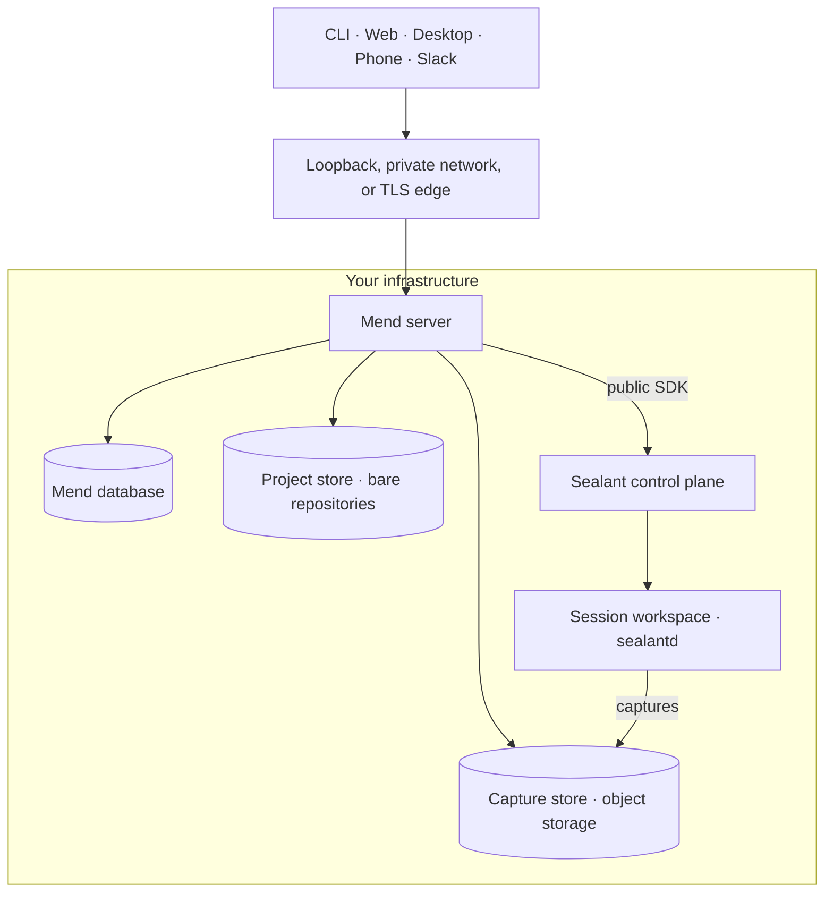
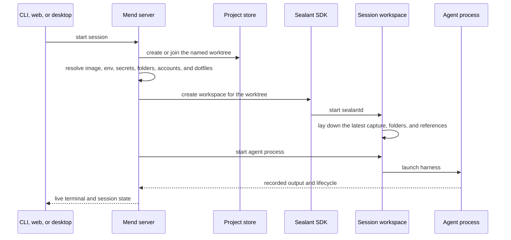
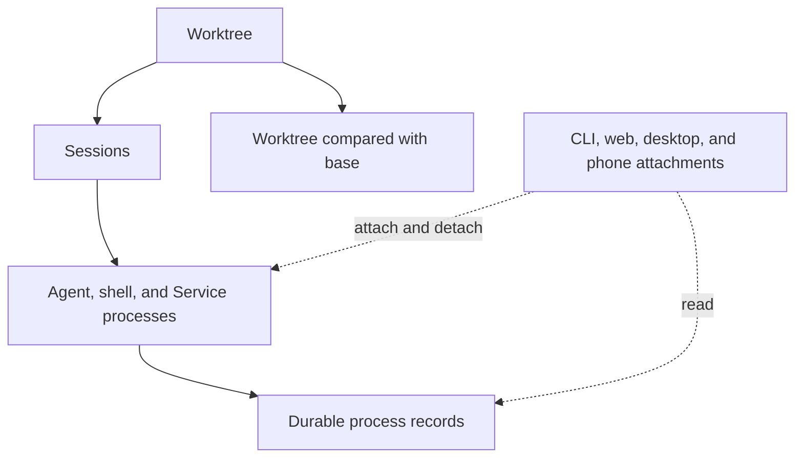

Mend puts the work on a machine you control and makes that machine reachable through familiar local
interfaces. The CLI still behaves like a terminal command. The web and desktop apps still behave
like local tools. The agent process, worktree, and development services keep running on the Mend
machine when a client disconnects.

## Deployment

A Mend installation has one product boundary. Clients connect to Mend. Underneath, Mend is built on
**Sealant**: a separate workspace platform that creates the isolated environments where agents run,
builds their images, supervises their processes, and records everything that happens in them. Mend
talks to Sealant only through its public SDK, and every install ships both. You never use Sealant
directly.

The supervision and recording happen inside the workspace itself. Every workspace container boots
`sealantd`, a static Sealant binary that runs as PID 1: it starts and watches the agent, shell, and
Service processes, writes their typed record events (process, io, file, network, runtime), and
answers the control channel the Sealant control plane drives: a local control socket on a single
host, an authenticated network channel on Kubernetes. When Mend attaches a terminal, replays a
record, or runs a check, that request ends at `sealantd` in the workspace.



On a single host, `mend server setup` runs Mend and its pinned Sealant control plane in one
application container, Postgres in a second, and Garage, the object store that holds session
captures, in a third. Web and workspace SSH bind to localhost by default and Postgres publishes no
port. Binding another address is an explicit setup choice; read
[Install Mend](/getting-started/install/#network-boundary). How the instance is reached (loopback, a
private network, or public behind an edge) is its exposure; read [Exposure](/operate/exposure/). On
Kubernetes, Sealant is installed separately; read
[Deploy on Kubernetes](/operate/deploy-kubernetes/).

## Project store

Adopting a repository creates a Mend-owned copy in the central store:

```text
<store>/<project>/repo.git              bare repository: adoption, fetches, landing pushes
bucket: captures/<worktree>/<epoch>/…   each worktree's chain of captures
Postgres                                the head of each chain
```

Mend never runs an agent against an existing checkout that it does not own. Your previous checkout
remains a peer. Exchange commits through Git when you want work to move between them.

The bare repository is shared by the project's worktrees. A worktree is a durable named place (its
own checkout on its own branch) and sessions are conversations inside it. Its files live as a chain
of captures in object storage, not as a checkout directory on the Mend host. Two worktrees never
share a working directory, so unrelated work runs side by side; two sessions in the same worktree
deliberately do share one, which is how a second agent joins work already in progress.

An install adopted before the capture store still has `<store>/<project>/worktrees/` directories.
The first launch or resume in such a worktree registers its current files, uncommitted ones
included, as the worktree's first capture.

## Starting a session

A launch joins repository state, project configuration, and your account settings at one boundary.



Changes to project setup apply to the next workspace launch. A running workspace keeps the image,
variables, secrets, folders, and dotfiles it started with. Resuming a settled session creates a new
workspace when no retained workspace remains, so the latest setup applies then.

## What persists

A browser tab or terminal attachment is only a client. Closing it does not define the session's
lifetime.



The worktree is the durable place; a session is one conversation against it plus its record. A
worktree holds many sessions over its life, several can be live at once, and it survives every one
of them: deleting a session leaves the worktree, its change, and its checkpoints standing. Agent
processes can stop and resume over the life of a session. Supporting shells and Services use the
same workspace and can keep it alive after an agent settles.

## Where uncommitted files live

The workspace works on a checkout on its own disk. `sealantd` captures the worktree's files,
uncommitted ones included, into the capture store a couple of seconds after they stop changing, and
at least every ten seconds while they keep changing. The capture chain is the authoritative copy;
the workspace's disk is a cache of it. Review, diffs, and checkpoints read the captures. That
placement decides what survives each lifecycle event:

- An agent that exits, a session that settles, or a workspace that stops or is replaced leaves the
  worktree as its last capture holds it. Uncommitted files, staged or not, are part of the capture.
  Mend never commits, stashes, or cleans them.
- Resuming a settled session lays the latest capture down in the next workspace. Everything is where
  it was, committed or not, and the reviewable change (the worktree against its base) includes it.
- A workspace lost between captures loses only the writes made since its last capture.
- The worktree and the harness's own state are captured. Other files in the container, such as
  system packages installed by hand and `/tmp`, are gone when the workspace is replaced.
- Organization folders and references arrive as copies beside the worktree. Writes inside them stay
  in that workspace and do not travel back to the folder.
- Deleting a session removes only its conversation record; the worktree, its change, and its
  checkpoints remain. Removing the worktree is a separate explicit act that takes uncommitted
  changes with it. Mend refuses it while any session, process, or Service forward in it is live. It
  also refuses while the change is not on origin, and the refusal names the files and line counts
  that are not landed. A worktree whose change is its last landing goes without force when origin's
  branch still holds the landed commit or the pull request was last reported merged. Read
  [Land a change](/guides/land-a-change/).

## Environment and identity

Mend resolves several inputs before creating a workspace:

- the project, organization, or instance workspace image;
- configuration variables and secrets;
- selected reference repositories and [organization folders](/organizations/folders/);
- the launching user's connected Claude, Codex, and GitHub accounts;
- the launching user's Git author (`mend git-author`), which defaults to the name and email they
  registered with;
- the launching user's synced dotfiles when the project enables them, and a default zsh profile
  where the dotfiles left no `~/.zshrc` in a zsh image;
- the user's and the project's [skills](/guides/skills/);
- Service recipes from `mend.toml`;
- the session worktree and base reference.

Read [Configure session environments](/guides/project-environment/) for the full setup path.

## Context status

Repository instructions, references, folders, project configuration, and previous session records
already live beside the work. Named context items, context packs, immutable session snapshots, and
editable handoffs are part of the product direction but are not shipped yet.

Read [Context](/concepts/context/) for the current boundary.
