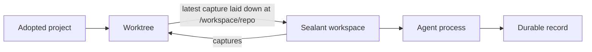

A session is one supervised coding-agent conversation and its durable record, running inside a
worktree: a durable named checkout in the project store. A worktree holds many sessions over its
life, several live at once, and owns the one reviewable change they all contribute to. A session can
contain several agent processes over time plus supporting shells and Services.

## Before you start

You need:

- a working Mend login;
- an adopted project;
- the provider CLI installed in the selected workspace image;
- a connected provider account, or a harness that can complete its own login flow.

Check the local setup:

```sh
mend doctor
```

## Launch from a checkout

Move into a checkout whose remote matches the adopted project:

```sh
cd ~/Developer/my-project
mend codex
```

Use another harness or command:

```sh
mend claude
mend opencode
mend run -- bash -i
```

If no adopted project matches but the current directory is a Git checkout with a network `origin`, a
harness launch adopts that origin URL first; the server clones it and never receives your local
files. Run `mend adopt` yourself when you want to choose the project name or Git authentication
mode.

Select a project explicitly from another directory:

```sh
mend codex --project my-project
```

## Send the first prompt

Pass one quoted argument:

```sh
mend codex "Trace the session startup path and explain it before changing code"
```

The prompt becomes the first message and supplies the initial session name. Interactive launches ask
for the worktree's name first (enter accepts an automatic one); `--name` answers it up front.

Common options:

```sh
mend codex "Fix the failing test" --model gpt-5.5 --effort high --base main
mend claude "Inspect the API boundary" --ask
```

Mend normally disables the harness's approval prompts because the workspace is the execution
boundary. `--ask` restores provider prompts. `--fast` requests Codex priority processing. OpenCode
currently ignores model, effort, permission, and speed options.

Press `Ctrl+V` with an image on your clipboard to send the image to the session and paste its path;
Codex and Claude read it. This needs `wl-paste` on Wayland or `xclip` on X11, and nothing extra on
macOS.

## Join an existing worktree

Naming a worktree that already exists joins it. The launch becomes a second conversation in the same
checkout, alongside anything already running there:

```sh
mend claude "Review the auth changes so far" --name fix-auth
```

`--worktree` joins only, and fails with the candidate names when nothing matches. Use it in scripts
where creating a new worktree by typo would be worse than failing:

```sh
mend codex "Run the test suite and fix what breaks" --worktree fix-auth
```

Requesting a different `--base` for an existing worktree is refused rather than silently re-basing
it. In the dashboard, `n` starts another session inside the selected worktree and `w` starts a new
worktree. Read [Terminal dashboard and attach](/clients/terminal/).

List worktrees and the sessions inside them:

```sh
mend worktrees
```

## What Mend creates



Before the process starts, Mend resolves the workspace image, project environment, secrets,
references, folders, skills, connected accounts, Git author, and dotfiles. It then opens a PTY or
provider protocol process in the worktree at `/workspace/repo`.

## Detach without stopping

Press:

```text
Ctrl+]
```

The CLI closes its attachment and leaves the agent running. A browser or desktop client can attach
to the same session while the terminal is detached.

Sessions run in the background by default: closing the terminal window or losing the connection also
leaves the session running. Launch with `--detach` to skip attaching entirely, and stop explicitly
with:

```sh
mend stop 01MEND
```

The record and review remain. Services keep running after a stop, and a running Service keeps the
workspace up; the stop then says so, for example `agent stopped · 3 services keep the workspace up`.
Stop the Services too with:

```sh
mend stop --services 01MEND
```

Once nothing is live, the workspace closes.

`--foreground` gives one launch foreground semantics: the session stops when the launching `mend`
exits. The default is the "Run sessions in the background" switch. The operator sets the instance's
default in Settings, an organization owner sets the organization's default over it, and a project's
setup page can override both.

## Reattach

List active sessions:

```sh
mend sessions
```

Attach with a full ID or unique prefix:

```sh
mend attach 01MEND
```

Mend replays recorded terminal output before following live frames. A session that was picked up on
the phone is taken back into this terminal: the phone's agent ends and the same conversation
continues here.

On a remote server, attaching tunnels the session's live Services declared `--http` or `--https` to
this machine's loopback, one line per tunnel, for example `web → http://localhost:5173`.
`--no-tunnel` turns this off. Read [Development services](/guides/services/).

## Open a supporting shell

```sh
mend shell 01MEND
```

The shell runs in the session's current workspace and sees the same worktree, installed packages,
environment, and Services. Shell changes contribute to the same session change.

Closing a shell tab can stop that shell process. A detached shell can keep the workspace retained
after the agent settles.

## Resume settled work

Resume with the previous harness:

```sh
mend resume 01MEND
```

Switch harnesses while keeping the worktree and restored provider state:

```sh
mend resume 01MEND --with claude
```

`mend rejoin` chooses attach when the session is live and resume when it is settled:

```sh
mend rejoin 01MEND
```

`mend continue` resumes a session with the review comments you sent to it as its first message:

```sh
mend continue 01MEND
```

A resumed agent is another process in the same Mend session. Its Sealant run has its own record
sequence, while Mend preserves the ordered process and run membership.

A conversation session (started from Slack, or from the web or phone composer) waits between turns
with its workspace up. After 15 idle minutes (no turn running, nothing waiting on you, no Service or
open shell) Mend stops it the way Stop does, and it reads
`idle · stopped after 15 min · reply to resume`. Send the next message, or resume it, to go on in
the same conversation. The operator sets the minutes with `MEND_PROTOCOL_IDLE_STOP_MINUTES` (`0`
turns the stop off).

## What happens to your files

The workspace works on its own disk, and `sealantd` captures the worktree's files, uncommitted ones
included, to the Mend store every few seconds while they change. When the agent settles, the
workspace stops, or you resume days later, the next workspace starts from the latest capture.
Nothing is committed, stashed, or cleaned automatically, and the reviewable change is the worktree
against its base, committed or not.

What does not survive a workspace replacement is what the capture leaves out: system packages
installed by hand, `/tmp`, and writes inside organization folders, which arrive as copies. Deleting
a session removes only the conversation record; the worktree, its change, and its checkpoints
remain. Removing the worktree is its own explicit act, and it deletes uncommitted changes with it.
It is refused while any session is live, and refused again while the change is not on origin, naming
the files and line counts that are not landed.

Read [How Mend works](/concepts/how-mend-works/#where-uncommitted-files-live) for the full boundary.

## Review and land

The dashboard's `v`, the web app, and the desktop app show the worktree's change against its base
with the record beside it. Comments you send go back to the same session. Read
[Review a change](/guides/review-a-change/).

Landing pushes the change to origin and opens its pull request. Run `mend land <session>`, or launch
with `--land` so Mend lands after each turn that asked for a change; `--no-land` keeps one session
from landing when the project's "Land when a turn completes" setting is on. Mend lands after turns
it runs itself, so a session attached to your terminal lands on its own only once it is picked up on
the phone. Read [Land a change](/guides/land-a-change/).

## See sessions from any client

The CLI, browser, desktop app, and phone connect to the same Mend server. They do not create
separate copies of the session.

Read [Work from another device](/guides/remote-access/) for pairing and reattachment.
