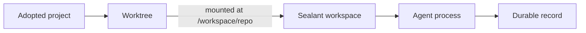

A session is one supervised coding-agent conversation and its durable record, running inside a
worktree — a durable named checkout in the project store. A worktree holds many sessions over its
life, several live at once, and owns the one reviewable change they all contribute to. A session can
contain several agent processes over time plus supporting shells and Services.

## Before you start

You need:

- a working Mend login;
- an adopted project;
- the provider CLI installed in the selected workspace image;
- a connected provider account, or a harness that can complete its own login flow.

Check the local setup:

```sh
mend doctor
```

## Launch from a checkout

Move into a checkout whose remote matches the adopted project:

```sh
cd ~/Developer/my-project
mend codex
```

Use another harness or command:

```sh
mend claude
mend opencode
mend run -- bash -i
```

If no adopted project matches but the current directory is a Git checkout with a network `origin`, a
harness launch adopts that origin URL first; the server clones it and never receives your local
files. Run `mend adopt` yourself when you want to choose the project name or Git authentication
mode.

Select a project explicitly from another directory:

```sh
mend codex --project my-project
```

## Send the first prompt

Pass one quoted argument:

```sh
mend codex "Trace the session startup path and explain it before changing code"
```

The prompt becomes the first message and supplies the initial session name. Interactive launches ask
for the worktree's name first (enter accepts an automatic one); `--name` answers it up front.

Common options:

```sh
mend codex "Fix the failing test" --model gpt-5.5 --effort high --base main
mend claude "Inspect the API boundary" --ask
```

Mend normally disables the harness's approval prompts because the workspace is the execution
boundary. `--ask` restores provider prompts. `--fast` requests Codex priority processing. OpenCode
currently ignores model, effort, permission, and speed options.

## Join an existing worktree

Naming a worktree that already exists joins it — the launch becomes a second conversation in the
same checkout, alongside anything already running there:

```sh
mend claude "Review the auth changes so far" --name fix-auth
```

`--worktree` joins only, and fails with the candidate names when nothing matches — use it in scripts
where creating a new worktree by typo would be worse than failing:

```sh
mend codex "Run the test suite and fix what breaks" --worktree fix-auth
```

Requesting a different `--base` for an existing worktree is refused rather than silently re-basing
it. In the dashboard, `s` starts a session inside the selected worktree.

List worktrees and the sessions inside them:

```sh
mend worktrees
```

## What Mend creates



Before the process starts, Mend resolves the workspace image, project environment, secrets,
references, mounts, connected accounts, and dotfiles. It then opens a PTY or provider protocol
process in the mounted worktree.

## Detach without stopping

Press:

```text
Ctrl+]
```

The CLI closes its attachment and leaves the agent running. A browser or desktop client can attach
to the same session while the terminal is detached.

Sessions run in the background by default: closing the terminal window or losing the connection also
leaves the session running. Launch with `--detach` to skip attaching entirely, and stop explicitly
with:

```sh
mend stop 01MEND
```

The record and review remain. The `Sessions` switch in Settings flips the default to foreground
semantics — the session stops when the launching `mend` exits.

## Reattach

List active sessions:

```sh
mend sessions
```

Attach with a full ID or unique prefix:

```sh
mend attach 01MEND
```

Mend replays recorded terminal output before following live frames.

## Open a supporting shell

```sh
mend shell 01MEND
```

The shell runs in the session's current workspace and sees the same worktree, installed packages,
environment, and Services. Shell changes contribute to the same session change.

Closing a shell tab can stop that shell process. A detached shell can keep the workspace retained
after the agent settles.

## Resume settled work

Resume with the previous harness:

```sh
mend resume 01MEND
```

Switch harnesses while keeping the worktree and restored provider state:

```sh
mend resume 01MEND --with claude
```

`mend rejoin` chooses attach when the session is live and resume when it is settled:

```sh
mend rejoin 01MEND
```

A resumed agent is another process in the same Mend session. Its Sealant run has its own record
sequence, while Mend preserves the ordered process and run membership.

A conversation session (started from Slack, or from the web or phone composer) waits between turns
with its workspace up. After 15 idle minutes (no turn running, nothing waiting on you, no Service or
open shell) Mend stops it the way Stop does, and it reads
`idle · stopped after 15 min · reply to resume`. Send the next message, or resume it, to go on in
the same conversation. The operator sets the minutes with `MEND_PROTOCOL_IDLE_STOP_MINUTES` (`0`
turns the stop off).

## What happens to your files

The worktree lives on the Mend machine, not inside the workspace container. When the agent settles,
the workspace stops, or you resume days later, uncommitted files stay exactly where the last process
left them. Nothing is committed, stashed, or cleaned automatically, and the reviewable change is the
worktree against its base, committed or not.

What does not survive a workspace replacement is everything outside the worktree: packages installed
into the container, the workspace home directory, `/tmp`. Deleting a session removes only the
conversation record — the worktree, its change, and its checkpoints remain. Removing the worktree is
its own explicit act: it is refused while any session is live, refuses again while the worktree
still holds any change against its base, and deletes uncommitted changes with it.

Read [How Mend works](/concepts/how-mend-works/#where-uncommitted-files-live) for the full boundary.

## See sessions from any client

The CLI, browser, desktop app, and phone connect to the same Mend server. They do not create
separate copies of the session.

Read [Work from another device](/guides/remote-access/) for pairing and the private-network
boundary.
