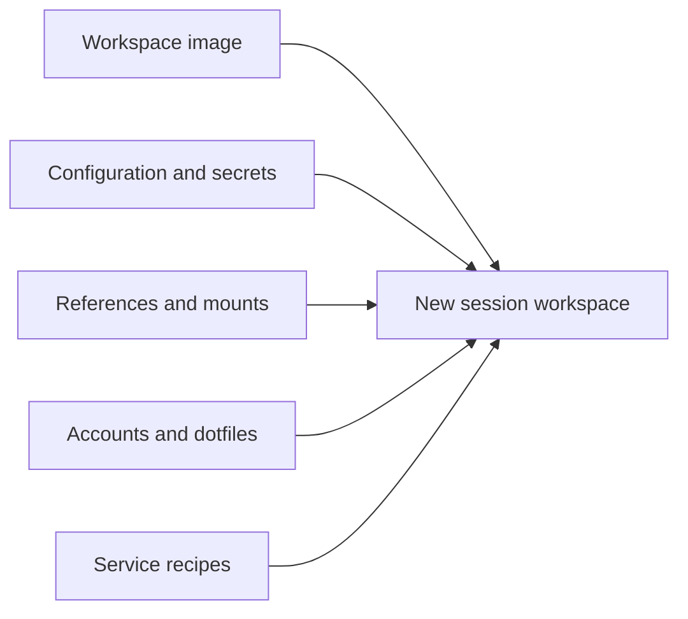

A project's setup controls how its future session workspaces launch. Open the project in Mend and
choose **Setup** to configure it.

Setup joins machine resources and personal identity at session launch:



Changes apply to new workspace launches, including a settled-session resume that needs a fresh
workspace. Running workspaces keep the setup they started with.

## Workspace image

Choose a managed OS family or supply a custom OCI base image. Managed families let you select the
OS, login shell, portable package names, and Docker service. Custom images accept a base reference,
extra packages, setup commands, and the Docker service switch.

A project can inherit the instance default or save its own override. Read
[Workspace images](/guides/workspace-images/) for the exact fields and defaults.

## Configuration and secrets

Configuration values and secrets both become environment variables in future workspace processes.
They differ in storage and display:

- configuration is stored and displayed as plaintext;
- secret values are accepted on write and never returned by the API or CLI;
- names that look secret are routed to Secrets when importing a `.env` file;
- URL-shaped names may still contain passwords, so route them explicitly when needed.

On a Kubernetes install a project can additionally hold cluster bindings: names of cluster Secrets
and ConfigMaps the platform resolves into workspace environment at each fresh launch, plus an
optional workspace service account. Mend stores the names only and never learns the contents.

Read [Environment variables and secrets](/guides/environment-variables/) for the web and CLI paths,
including the cluster-binding rules and their current launch gate.

## Reference repositories

A reference is an upstream repository cloned into Mend's store for agents to read. Select references
per project. Sessions mount the selected revisions read-only under:

```text
/workspace/ref/<name>
```

References do not become projects. They have no sessions or worktrees. They widen what the agent can
read without widening the reviewable change.

## Extra mounted folders

Add a host folder when a session needs local material that does not belong in the project
repository. Mend mounts it at:

```text
/workspace/home/<name>
```

Mounts are read-only by default. A read-write mount writes directly to the host folder, outside the
session's reviewed worktree. Use read-write only when that is the intended behavior.

The path must exist on the Mend server's own filesystem. In the Docker deployment that is the
application container, so a folder on your laptop or on the Docker host is not mountable; only paths
under the store volume (`/var/lib/mend/store`) can be mapped into a workspace there. Use a reference
repository for material that lives in Git.

## Dotfiles

Dotfiles belong to each Mend user. The project setting only decides whether sessions apply the
launching user's dotfiles.

Managed OS-family images support dotfiles. Custom images do not apply them because the base image
owns its environment. Read [Dotfiles](/guides/dotfiles/) for repository and local-sync options.

## Services

A Service is an explicitly declared development process associated with a session. Add recipes to
`mend.toml` or start a command with `mend service run`. Mend records each attempt.
`mend service connect <name>` brings the declared port to your machine's loopback over an
authenticated WebSocket; `mend service run` opens that tunnel by itself only when the CLI points at
a non-loopback server URL, and never for UDP.

Services do not start or expose themselves automatically. HTTP and HTTPS are separate declarations;
other transports provide an endpoint to copy rather than a browser action.

## Hot sessions

A project's hot-session count controls how many standby executors Mend keeps ready. A standby has
the project's base and the shared dependency cache for its platform materialised, and a workspace
built from the current setup fingerprint; a new session claims one and its worktree is bound at
claim.

Changing the image, accounts, dotfiles, mounts, or related launch inputs drains incompatible ready
workspaces and warms replacements. Status such as `2 ready · 1 warming` reports observation, not a
launch guarantee. A standby serves a fresh worktree; a session joining a worktree that already holds
captures starts cold until the executor can materialise a delta.

## Install command

The install command builds a project's dependency tree — `pnpm install --frozen-lockfile`,
`cargo fetch --locked`, whatever the project needs. Leave it empty and Mend detects it from the
lockfile at the root of the base tree at launch. Mend runs it in two places, both under its own
control:

- in a workspace whose captured dependency tree was built for another platform (or that has none
  yet), before the harness starts — the log line names the platform observed and the command;
- in an install session Mend launches itself when the command changes, whose result fills the
  project's shared cache for that platform. Standby executors and cold launches read that cache.

A session's own dependency tree is captured with its work, like any other bytes, and is never
promoted into the shared cache: what one agent installed is that session's, not the project's.

## Git access

Git operations on the remote repository are host-owned. A project can use ambient host credentials,
a Mend deploy key, or the SSH-agent bridge for a key that must remain on another machine. The
workspace receives a Git transport shim, not the host credential.

## Review automation

Project switches can inherit instance defaults or override automatic session naming, review-tour
composition, and suggestion generation. These jobs run after the relevant session event. They do not
change the workspace environment.
