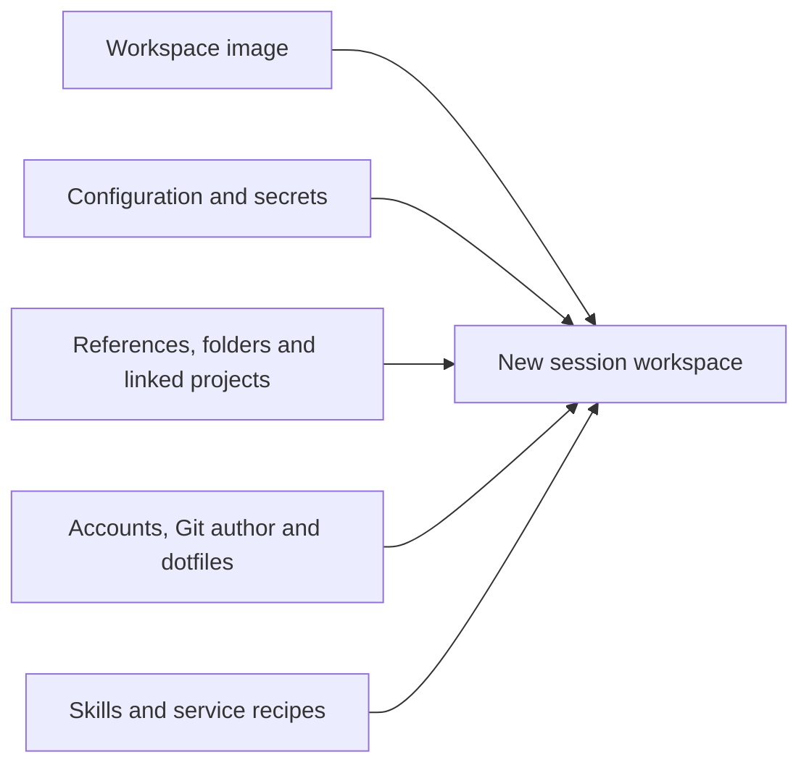

A project's setup controls how its future session workspaces launch. Open the project in Mend and
choose **Setup** to configure it.

Setup joins machine resources and personal identity at session launch:



Changes apply to new workspace launches, including a settled-session resume that needs a fresh
workspace. Running workspaces keep the setup they started with.

## Who can change setup

The project's creator and the organization's owners manage its setup. Other members of a shared
project see a note in place of the setup panels: "How sessions here launch is set by the project's
creator or an organization owner. You can start sessions and review changes as it stands."

## Visibility

Owners see a **Visibility** section at the top of Setup. A `private` project is visible only to its
creator. A `shared` project is visible to every member of the organization, who can start sessions
in it and review its changes. Making a shared project private drains other members' warm workspaces;
their running sessions continue until they end. Read [Organizations](/organizations/overview/) for
roles and shared control.

## Where defaults come from

The workspace environment and the automation switches (background sessions, description and tour,
fix suggestions, session naming, landing) resolve project, then organization, then instance. The
instance's defaults belong to the operator, and only the operator sees them in Settings. An
organization's owners set their own in Settings, value by value, over the instance's; members read
what applies and where it came from. A project that inherits takes its organization's value. Each
change to an organization's defaults is recorded in its audit log.

## Workspace image

Choose a managed OS family or supply a custom OCI base image. Managed families let you select the
OS, login shell, portable package names, and Docker service. Custom images accept a base reference,
extra packages, setup commands, and the Docker service switch.

A project can inherit its organization's default or save its own override. Read
[Workspace images](/guides/workspace-images/) for the exact fields and defaults.

## Skills

The **Skills** section decides whether the project's sessions receive your global skill library
(**Use global skills**) and holds skills that apply only to this project. A project skill with the
same name as a global one replaces it. Running sessions keep the skills they started with. Read
[Skills](/guides/skills/) for the library and `mend skills push`.

## Configuration and secrets

Configuration values and secrets both become environment variables in future workspace processes.
They differ in storage and display:

- configuration is stored and displayed as plaintext;
- secret values are accepted on write and never returned by the API or CLI;
- names that look secret are routed to Secrets when importing a `.env` file;
- URL-shaped names may still contain passwords, so route them explicitly when needed.

On a Kubernetes install a project can additionally hold cluster bindings: names of cluster Secrets
and ConfigMaps the platform resolves into workspace environment at each fresh launch, plus an
optional workspace service account. Mend stores the names only and never learns the contents.

Read [Environment variables and secrets](/guides/environment-variables/) for the web and CLI paths,
including the cluster-binding rules and their current launch gate.

## Reference repositories

A reference is an upstream repository cloned into Mend's store for agents to read. References belong
to the organization: owners add, refresh, and remove them, and the clone uses the owner's own Git
access. Each project selects the references its sessions receive, at:

```text
/workspace/ref/<name>
```

In a captured workspace (the default store), a reference arrives as a copy of its tree at the
fetched revision, without Git history. It is read-only either way.

References do not become projects. They have no sessions or worktrees. They widen what the agent can
read without widening the reviewable change.

## Folders

A folder is a Mend-managed directory that belongs to the organization, for material that does not
belong in the project repository. Folders are created and filled in Settings. A project selects the
folders its sessions receive, at:

```text
/workspace/home/<name>
```

A selected folder is read-only unless you tick **sessions may write** for it. In a captured
workspace (the default store) a folder arrives as a copy, so writes inside a session stay in that
session's workspace and never change the folder. Read [Folders](/organizations/folders/) for
creating and filling them.

On a single-tenancy install the operator also sees **Mounted folders**, which maps a path on the
Mend server's own filesystem into sessions at the same location. A read-write host mount writes to
that path directly, outside the reviewed change. Captured workspaces do not receive host mounts, and
nobody but the operator sees the section.

## Linked projects

A linked project is another adopted project in the same organization that this project's sessions
can work in, read-write, at:

```text
/workspace/repos/<name>
```

Mend binds one of the linked project's worktrees at launch (the default branch's unless you name
one). Commits there are the linked project's own change and review on its side. A link is skipped
when the session's owner cannot see the linked project. Captured workspaces do not receive linked
projects.

## Dotfiles

Dotfiles belong to each Mend user. The project's **Dotfiles** switch decides whether sessions apply
the launching user's dotfiles. A second switch, **Default shell profile**, decides whether Mend
writes its default zsh profile where the dotfiles left no file.

Managed OS-family images support both. Custom images apply neither because the base image owns its
environment. Read [Dotfiles](/guides/dotfiles/) for repository and local-sync options and the
default shell profile.

## Services

A Service is an explicitly declared development process associated with a session. Add recipes to
`mend.toml`, add them in the **Services** section of Setup, or start a command with
`mend service run`. Mend records each attempt. `mend service run` tunnels the declared port to your
machine's loopback over an authenticated WebSocket when the CLI points at a non-loopback server URL,
unless you pass `--no-connect`, and never for UDP. `mend attach`, `mend codex`, and the dashboard
tunnel an attached session's `--http` and `--https` Services the same way.

Services do not start or expose themselves automatically. HTTP and HTTPS are separate declarations;
other transports provide an endpoint to copy rather than a browser action. Read
[Development services](/guides/services/).

## Hot sessions

A project's hot-session count controls how many standby workspaces Mend keeps ready for each person
who started a session in the project in the last seven days, for up to four people, most recent
first. A standby has the project's base and the shared dependency cache for its platform
materialised, and a workspace built from the current setup fingerprint; a new session claims one of
its owner's standbys and its worktree is bound at claim. Each ready workspace is a live container on
the machine, so the count applies per person.

Changing the image, accounts, dotfiles, folders, or related launch inputs drains incompatible ready
workspaces and warms replacements. Status such as `2 ready · 1 warming` reports observation, not a
launch guarantee. A standby serves a fresh worktree; a session joining a worktree that already holds
captures starts cold until the executor can materialise a delta.

## Install command

The install command builds a project's dependency tree, for example `pnpm install --frozen-lockfile`
or `cargo fetch --locked`. Leave it empty and Mend detects it from the lockfile at the root of the
base tree at launch. Mend runs it in two places, both under its own control:

- in a workspace whose captured dependency tree was built for another platform (or that has none
  yet), before the harness starts; the log line names the platform observed and the command;
- in an install session Mend launches itself when the command changes, whose result fills the
  project's shared cache for that platform. Standby workspaces and cold launches read that cache.

A session's own dependency tree is captured with its work, like any other bytes, and is never
promoted into the shared cache: what one agent installed belongs to that session.

## Git access

Git operations on the remote repository run on the Mend server. A project uses your Mend key (one
key per user, held on the server), the SSH-agent bridge for a key that stays on your machine, or the
server's ambient credentials. The workspace receives a Git transport shim, not the credential, and
by default the shim signs only for the project's own remote host. Each session commits as its
owner's Git author. Read [Git access](/guides/git-access/).

## Automation

Project switches can inherit the organization's defaults or override them with `on` or `off`:

- **Review automation**: **Description & tour**, **Suggest fixes**, and **Name the session**. These
  jobs run after the relevant session event.
- **Sessions**: **Run sessions in the background**, whether sessions keep running when every client
  disconnects.
- **Landing**: **Land when a turn completes**, whether a session pushes its change and opens or
  updates its pull request after a completed turn that asked for a change. Read
  [Land a change](/guides/land-a-change/).

None of these change the workspace environment.
