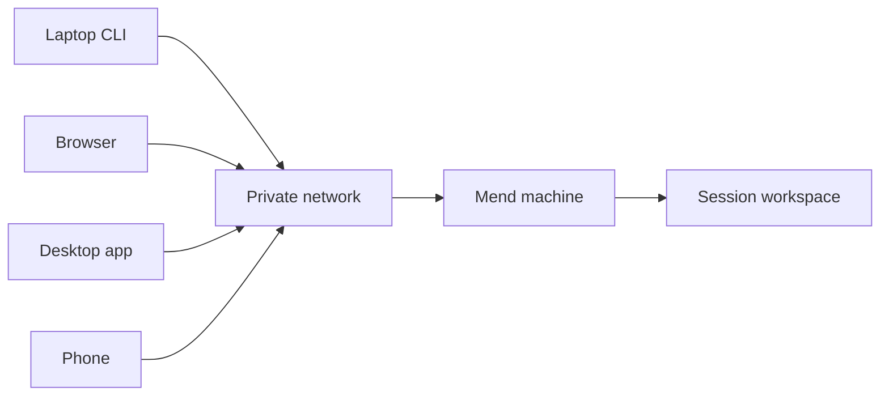

The work stays on the Mend machine. Other devices attach to it.

A terminal attachment, browser tab, desktop window, or phone is a client of the same session.
Closing one does not stop the agent, delete the worktree, or move the development service.



## Use a private network

Web and workspace SSH bind to localhost by default. Exposing them on a private network is an
explicit choice when you set up the server:

```sh
mend server setup --bind 0.0.0.0 --url http://mend-host:3105 \
  --origin http://localhost:3105
```

Postgres publishes no port and no image registry is published. Binding `0.0.0.0` opens every IPv4
interface and sign-up stays open to anyone who can reach Mend, so keep the machine on a network you
control. Read [Install Mend](/getting-started/install/#network-boundary).

Prefer Tailscale or another private network. Mend does not require public ingress for remote use. Do
not publish the server directly to the internet.

Plain HTTP on a LAN does not protect credentials from that network. If you are not using a private
encrypted network, place a trusted TLS boundary in front of Mend and test terminal WebSockets before
relying on it.

## Pair another device

On a signed-in machine, run:

```sh
mend pair
```

The command prints a QR code, a short code, and the address the second device should open. A pairing
code is valid for one device, one claim, and ten minutes.

The address comes from the origins configured on the server. `--url` selects one of those exact
URLs; it cannot introduce an address the server does not know:

```sh
mend pair --url http://mend-host.example:3105
```

After a successful claim, the new device receives its own revocable token. Revoke devices from
**Settings**.

Current device tokens have normal authenticated API access. Read-only and control scopes are planned
but not enforced yet. Pair only devices and users you trust with the whole Mend instance.

## Reattach from another terminal

Install the Mend CLI on the second machine, point it at the server, and sign in:

```sh
mend login --url http://mend-host:3105
mend sessions
mend attach <session-id-prefix>
```

`mend attach` replays the terminal stream and then follows live output. Press `Ctrl+]` to detach
without stopping the process. Set `MEND_DETACH_KEY=none` when an outer terminal multiplexer owns the
detach key.

## Browser and desktop

The web and desktop apps list the same projects and sessions. Use them to follow output, open a
shell, inspect project setup, and review the current change.

A browser disconnect does not define session status. Reopening the session resumes from its durable
record.

## Phone

The responsive web app is the no-install phone path. The native client under `apps/mobile` is not
published yet.

Mobile is for steering, terminal access, session status, development-service links, and review. It
is not intended to replace a full editor.

## Development services

A declared Service runs in a session workspace. `mend service connect <name>` binds its port on your
own machine's loopback over an authenticated WebSocket, on every deployment shape, with no extra
network exposure. `mend service run` opens that tunnel by itself when the CLI points at a
non-loopback server URL; against a server reached at `localhost` it prints the raw forward instead,
so run `mend service connect` explicitly there. That raw host forward is bound by the Mend server
process itself; in the Docker deployment that is the application container, not the Docker host.

Raw forwarded ports do not pass through Mend request authentication; when you expose one directly,
the private network is the access boundary. Declare HTTP or HTTPS before presenting a Service as a
browser link.
