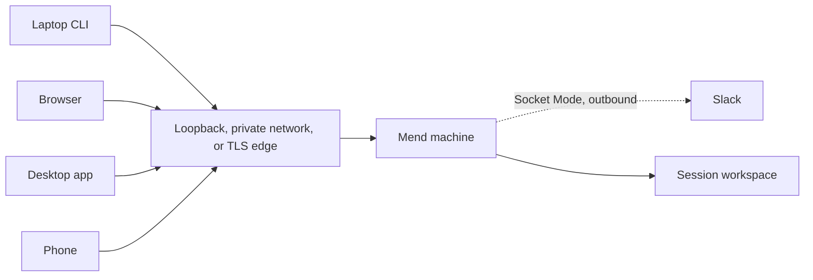

The work stays on the Mend machine. Other devices attach to it.

A terminal attachment, browser tab, desktop window, or phone is a client of the same session.
Closing one does not stop the agent, delete the worktree, or move the development service.



## Reach the server

Web and workspace SSH bind to localhost by default. Binding another address is an explicit choice
when you set up the server:

```sh
mend server setup --bind 0.0.0.0 --url http://mend-host:3105 \
  --origin http://localhost:3105
```

Postgres publishes no port and no image registry is published. Binding `0.0.0.0` opens every IPv4
interface. Registration closes after the first account and everyone else joins by invitation, so
create that account before anyone else can reach the server. Read
[Install Mend](/getting-started/install/#network-boundary).

A private network is one way to run Mend, not a requirement. Mend authenticates and authorizes every
request itself, so a tailnet or a VPN in front of it is an extra gate you may add. Tell Mend how it
is reached with `MEND_EXPOSURE`: `loopback`, `private` (the default: a network you control admission
to) or `public`. A server cannot observe what is published in front of it, so this is your
statement, and `mend doctor` reports what Mend observes beside it. `mend server setup` cannot set
`MEND_EXPOSURE`, so a setup install runs as `private`.

Plain HTTP on a LAN does not protect credentials from that network. Beyond the machine, put a TLS
edge in front of Mend. The repository has an opt-in Caddy overlay
(`deploy/docker/compose.edge.yaml`) that `mend server setup` does not install, and the Kubernetes
chart can render an Ingress to the web tier. Test a terminal through the edge before relying on it.

`public` refuses to start while an item of the public exposure gate that Mend can observe is open.
`mend operator exposure` lists them. Two items, `core-private` and `edge-tls`, no build can observe;
once you have verified one from outside, name it in `MEND_EXPOSURE_DECLARED` and the report shows it
as declared. An independent security reassessment of the exact release is also yours to record.
Nothing in Mend says an instance is fit to expose to the Internet. Read
[Exposure](/operate/exposure/).

## Pair another device

On a signed-in machine, run:

```sh
mend pair
```

The command prints a QR code, a short code, and the address the second device should open. A pairing
code is valid for one device, one claim, and ten minutes.

The address comes from the origins configured on the server. `--url` selects one of those exact
URLs; it cannot introduce an address the server does not know:

```sh
mend pair --url http://mend-host.example:3105
```

A device that cannot scan or type a code in time can take a token minted by hand: in the web app,
Settings → Devices → **Mint a token by hand** names the device and shows its token once, beside the
configured origins. In the mobile app it goes under Settings → Advanced as the server URL and bearer
token. Mend keeps only the token's hash.

After a successful claim, the new device receives its own revocable token. Revoke devices from
**Settings**.

A device token acts as your account, inside your organization, with everything your account may do.
Read-only and control scopes are planned but not enforced yet. Pair only devices you trust with your
account.

## Reattach from another terminal

Install the Mend CLI on the second machine, point it at the server, and sign in:

```sh
mend login --url http://mend-host:3105
mend sessions
mend attach <session-id-prefix>
```

`mend attach` replays the terminal stream and then follows live output. Press `Ctrl+]` to detach
without stopping the process. Set `MEND_DETACH_KEY=none` when an outer terminal multiplexer owns the
detach key. Attaching takes back a session that was picked up on the phone. Read
[Terminal dashboard and attach](/clients/terminal/).

Only a session's owner steers it: sends turns, answers approvals, interrupts, and types in its
terminal. Others who can see the project follow it read-only unless the owner turns on shared
control, which lets them steer with the owner's provider logins and Git access. Read
[Organizations](/organizations/overview/).

## Browser and desktop

The web and desktop apps list the same projects and sessions. Use them to follow output, open a
shell, inspect project setup, and review the current change. The desktop app can also resume a
session, hand it between terminal and protocol modes, and land its change; it has no published
release. Read [Desktop app](/clients/desktop/).

A browser disconnect does not define session status. Reopening the session resumes from its durable
record.

## Phone

The responsive web app is the no-install phone path. The native client under `apps/mobile` is not
published yet.

Mobile is for steering, terminal access, session status, development-service links, and review. It
is not intended to replace a full editor.

## Slack

An organization can connect its own Slack app. A Slack thread then starts sessions and receives
their reports, and `@mend <prompt>` in the thread sends a follow-up. Read
[Slack](/integrations/slack/).

## Development services

A declared Service runs in a session workspace. `mend service connect <name>` binds its port on your
own machine's loopback over an authenticated WebSocket, on every deployment shape, with no extra
network exposure. `mend service run` opens that tunnel by itself when the CLI points at a
non-loopback server URL; against a server reached at `localhost` it prints the raw forward instead,
so run `mend service connect` explicitly there. That raw host forward is bound by the Mend server
process itself; in the Docker deployment that is the application container, not the Docker host.

Services the agent or the web started need no command of yours. While `mend attach`, `mend codex`,
`mend claude`, `mend rejoin`, or the dashboard is attached to a session on a remote server, each
live Service declared `--http` or `--https` is tunneled to your loopback, on its own port when that
port is free. `--no-tunnel` turns this off. Looking at a remote server, the web and desktop apps
show `mend service connect <name>` where an Open link to the server's loopback would not load.

Raw forwarded ports do not pass through Mend request authentication; when you expose one directly,
the private network is the access boundary. Declare HTTP or HTTPS before presenting a Service as a
browser link.
