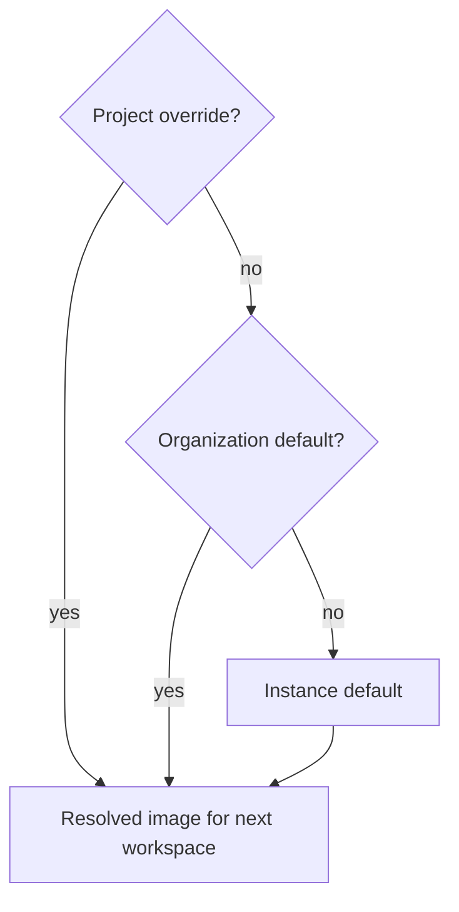

Every session runs inside a Sealant workspace built from an image definition. The definition
resolves at three levels: a project's override on its **Setup** page, then its organization's
default, then the instance default. See
[Instance, organization and project](#instance-organization-and-project).

A session records the image definition it launched with. Changing the setting affects later
workspace launches, not a workspace that is already running.

## Managed OS families

Managed images support four OS families:

- Arch Linux;
- Ubuntu;
- Fedora;
- Nix.

Each family builds for `amd64` and `arm64`. On ARM64, Arch Linux is built from Arch Linux ARM's
signed root filesystem, because the Docker Hub `archlinux` image is x86_64 only.

For a managed family, choose:

- the OS family;
- a login shell: `bash`, `zsh`, or `fish`;
- portable package names;
- whether the workspace receives a Docker service.

The default for a new install is Arch Linux with `zsh`, Docker enabled, and these packages:

```text
pnpm
python
uv
mise
github-cli
lazygit
bat
curl
jq
ripgrep
fd
fzf
starship
zsh-autosuggestions
zsh-syntax-highlighting
zsh-history-substring-search
direnv
```

The last five are what Mend's [default shell profile](/guides/dotfiles/#default-shell-profile) uses.
A saved instance, organization or project environment keeps its own shell and packages.

Mend checks each package name against the platform's package catalog when you save. Every id in the
default list installs on all four families, on both x86_64 and ARM64, from the family's own
repositories or from a pinned, checksum-verified release where the family has no package (`mise`,
`lazygit`, `uv`). Save is refused when a package cannot be resolved or is unsupported for the
selected family, and the refusal names each rejected entry. A saved definition stores each name as
the catalog id it resolved to, so an alias you typed may come back under its canonical id.

On the instance default, the operator also sees **Suggestions from this machine**. It checks a fixed
list of executable and config paths on the machine running Mend and offers matching packages. It
does not list your home directory or read config contents. Organization and project editors do not
offer the scan.

## Custom base images

Custom mode has three image inputs:

1. **Base image reference** such as `node:22-bookworm` or a private registry reference available to
   the platform.
2. **Extra packages**, one per line, passed to the package manager for that base.
3. **Setup commands**, one per line, run in the workspace before the harness starts.

The Docker service remains a separate switch.

Custom mode does not expose the managed login-shell selector. It guarantees only the shell supplied
by the base. Mend also does not apply user dotfiles to custom images. Put required shell setup in
the image or its setup commands.

Custom mode skips the managed package recipes. The build copies two static binaries into your image,
`sealantd` (the workspace supervisor, PID 1) and `socat`, and installs the harness CLIs with the
base's own `npm`. Extra packages pass verbatim to the base's package manager (`apt`, `apk`, `dnf`,
or `pacman`, detected from the base).

The base-image contract follows from that: any Linux `amd64`/`arm64` image with a POSIX shell at
`/bin/sh`, Node.js and npm (the harness CLIs run on the base's Node.js), and git. The build checks
the contract and fails with a readable message when the base misses a piece.

## Docker inside a workspace

The Docker switch requests a disposable daemon scoped to that workspace. Its isolation and privilege
model depend on the workspace runtime. Mend does not mount the host Docker socket. Compose files can
run inside the workspace against the provided daemon.

Changing the switch does not retrofit a workspace that is already running or retained. Joining or
resuming a session that reuses that workspace keeps the Docker capability it was created with. A
cold replacement uses the definition that resolves when the replacement is created.

On the AWS deployment, where sessions run in Lambda MicroVMs, the switch gives the MicroVM its own
daemon on every managed family (Sealant 0.36.1 and later).

On a Kubernetes deployment the operator has to enable the daemon (`workspaces.docker.enabled` on the
Sealant chart); otherwise a launch with the switch on is refused at create and the session says so.
There, the daemon shares the workspace Pod, its image graph has a per-workspace disk budget, and
nested containers' own memory and CPU limits are not enforced (the workspace's limits still apply).

The image definition is not a Compose editor. It describes one workspace container plus optional
platform services.

## Instance, organization and project

A launch uses the first definition it finds, in this order:

1. the project's override, saved on its **Setup** page;
2. the organization's default, which the organization's owners set in **Settings**;
3. the instance default, which only the operator sees and edits in **Settings**.

Members see the organization's resolved environment read-only, with where it came from. A project
override remains fixed until you edit it or choose **Use default**, which returns the project to
what it inherits. Each change to an organization's default is recorded in its audit log.



Changing a default affects every project that inherits it. Mend uses the resolved definition as part
of the hot-workspace fingerprint, so incompatible ready workspaces are replaced.

## Private images

A custom base may require registry access. The platform must be able to resolve and pull the image
before a workspace can start. Do not place registry credentials in setup commands, project
configuration, or the image reference.

The public docs do not yet define a supported registry-credential setup path. Treat a private-image
failure as a platform configuration issue and verify it outside Mend before depending on it for
sessions.
