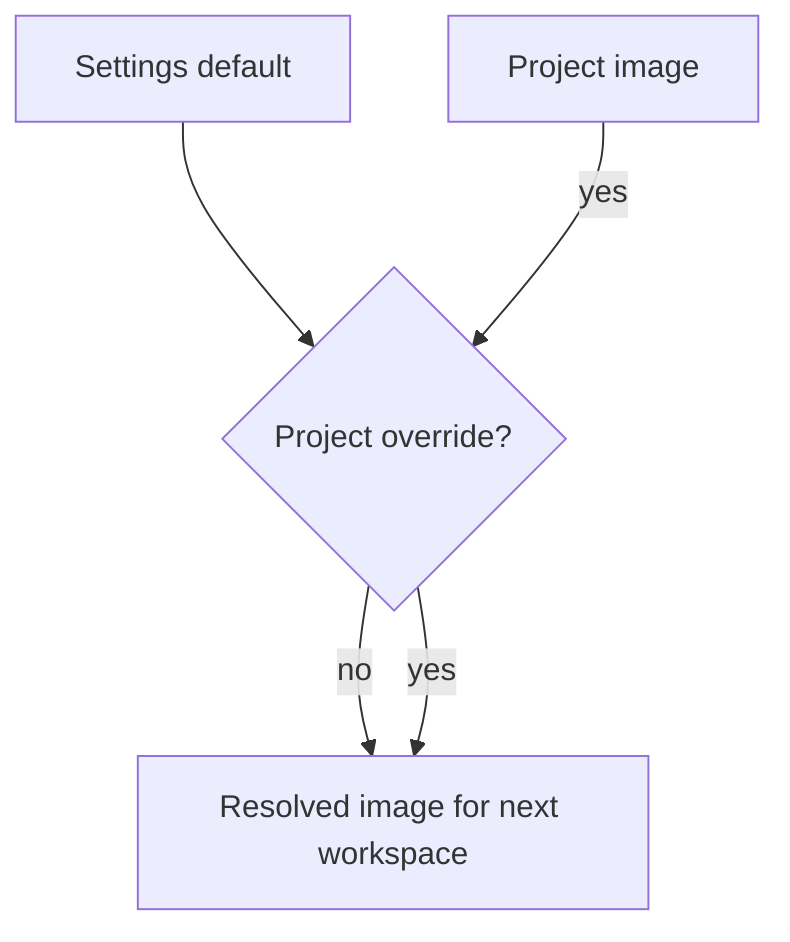

Every session runs inside a Sealant workspace built from an image definition. Mend has an
instance-wide default under **Settings** and an optional override under each project's **Setup**
page.

A session records the image definition it launched with. Changing the setting affects later
workspace launches, not a workspace that is already running.

## Managed OS families

Managed images support four OS families:

- Arch Linux;
- Ubuntu;
- Fedora;
- Nix.

For a managed family, choose:

- the OS family;
- a login shell: `bash`, `zsh`, or `fish`;
- portable package names;
- whether the workspace receives a Docker service.

The default for a new install is Arch Linux with `zsh`, Docker enabled, and these packages:

```text
pnpm
python
uv
mise
github-cli
lazygit
bat
curl
jq
ripgrep
fd
fzf
starship
zsh-autosuggestions
zsh-syntax-highlighting
zsh-history-substring-search
direnv
```

The last five are what Mend's [default shell profile](/guides/dotfiles/#default-shell-profile) uses.
A saved instance, organization or project environment keeps its own shell and packages.

Mend sends portable package names to the platform resolver. Save is refused when a package cannot be
resolved or is unsupported for the selected family. Fix or remove rejected entries before launching
sessions with that definition.

## Custom base images

Custom mode has three image inputs:

1. **Base image reference** such as `node:22-bookworm` or a private registry reference available to
   the platform.
2. **Extra packages**, one per line, passed to the package manager for that base.
3. **Setup commands**, one per line, run in the workspace before the harness starts.

The Docker service remains a separate switch.

Custom mode does not expose the managed login-shell selector. It guarantees only the shell supplied
by the base. Mend also does not apply user dotfiles to custom images. Put required shell setup in
the image or its setup commands.

Custom bases work because the platform overlays only static binaries onto your image: `sealantd`,
the workspace supervisor that runs as PID 1, plus the harness CLIs. The base-image contract is any
Linux `amd64`/`arm64` image with a POSIX shell at `/bin/sh`, Node.js with npm for the harness CLIs,
and git. The build checks the contract and fails readably when the base misses a piece.

## Docker inside a workspace

The Docker switch requests a disposable daemon scoped to that workspace. Its isolation and privilege
model depend on the workspace runtime. Mend does not mount the host Docker socket. Compose files can
run inside the workspace against the provided daemon.

Changing the switch does not retrofit a workspace that is already running or retained. Joining or
resuming a session that reuses that workspace keeps the Docker capability it was created with. A
cold replacement uses the instance default or project override that applies when the replacement is
created.

On a Kubernetes deployment the operator has to enable the daemon (`workspaces.docker.enabled` on the
Sealant chart); otherwise a launch with the switch on is refused at create and the session says so.
There, the daemon shares the workspace Pod, its image graph has a per-workspace disk budget, and
nested containers' own memory and CPU limits are not enforced (the workspace's limits still apply).

The image definition is not a Compose editor. It describes one workspace container plus optional
platform services.

## Instance default and project override

The instance default applies when a project has no image override. A project override remains fixed
until you edit it or choose **Use default**.



Changing the default affects every inheriting project. Mend uses the resolved definition as part of
the hot-workspace fingerprint, so incompatible ready workspaces are replaced.

## Private images

A custom base may require registry access. The platform must be able to resolve and pull the image
before a workspace can start. Do not place registry credentials in setup commands, project
configuration, or the image reference.

The public docs do not yet define a supported registry-credential setup path. Treat a private-image
failure as a platform configuration issue and verify it outside Mend before depending on it for
sessions.
