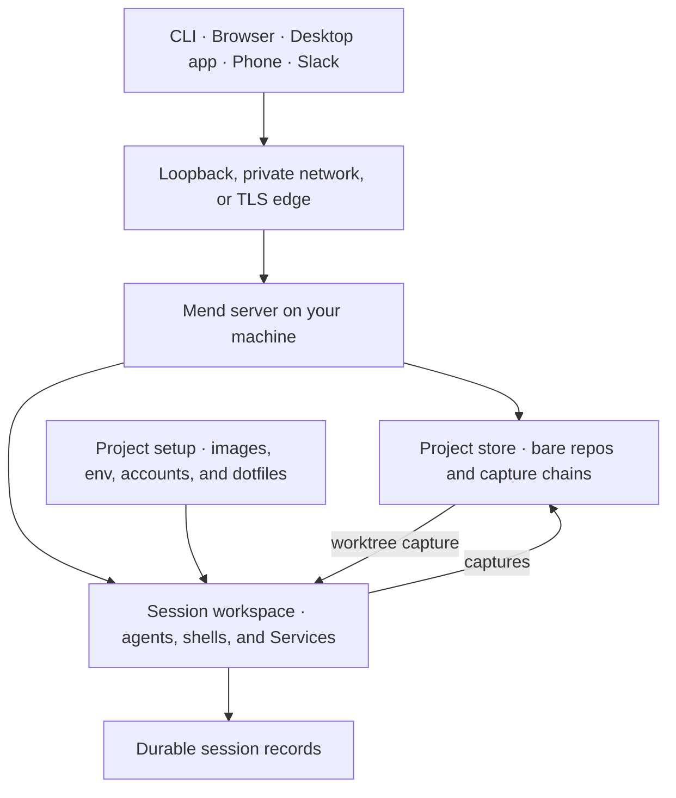
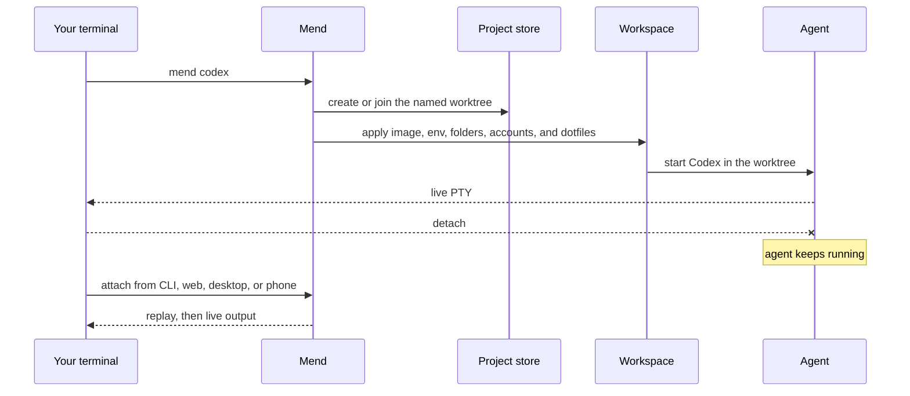

## Introduction

Mend is a self-hosted workbench for developers who run coding agents heavily, across projects and
devices. It co-locates the agents, their git worktrees, and the project context they run with on one
machine you control, and keeps working there feeling like local development from whichever device
you pick up: the terminal on your laptop, a browser, the desktop app, your phone.

Mend adopts repositories into one central store, gives work a durable named worktree (several agent
conversations can share one), and runs your existing agent inside a managed workspace over that
worktree. Every workspace boots `sealantd`, the Sealant supervisor that runs as PID 1 in the
container: it starts the agent and any shells or Services, records what they do, and serves the
control channel Mend drives through the Sealant SDK.

Sessions live on the Mend machine, not in your terminal, so a terminal is just one client. Start
Codex or Claude Code from the CLI and close the laptop. The agent keeps running next to its
worktree, dependencies, and development services, and you can attach again from any client, with
scrollback replayed and then the live process.

Development servers get the same treatment. Wrap the command you already run, `pnpm dev` or anything
else, in `mend service run`, and open the app at `127.0.0.1` on your machine, wherever the server
lives. It behaves like a local dev server, hot reload and all, while it actually runs next to the
agent on the Mend machine. Nothing is open to the public internet: no port is published, and the
bytes travel the authenticated WebSocket the CLI already holds to your Mend server.

Each launch also carries the agent's working inputs: repository instructions, references,
organization folders, project configuration, skills, provider accounts, dotfiles, and previous
session state. Named context packs and immutable snapshots are planned; the inputs listed here work
today.

When the work is done, review the change in the web app, the terminal, or the desktop app, send
comments back to the same session, and land it: Mend pushes the change to origin and opens its pull
request. Landing is optional, and Mend never merges.



## What Mend puts in one place

- Repositories adopted into a Mend-owned store, with durable named Git worktrees. Each worktree has
  one change and one review, shared by every session inside it.
- Codex, Claude Code, OpenCode, and arbitrary interactive commands launched through one session
  model.
- Workspace images, packages, setup commands, environment variables, secrets, organization folders,
  references, skills, and development Services configured per project.
- Personal Claude, Codex, and GitHub accounts, a Git author, and dotfiles that follow the user who
  starts a session.
- Agent, shell, and Service processes that keep running when a terminal or browser disconnects.
- CLI, web, desktop, and phone access to the same projects and sessions, on loopback, a private
  network, or behind a TLS edge. Slack threads can start and follow sessions too.
- An organization of owners and members, with private and shared projects.
- The worktree's accumulated Git change, its review, its landings, and the record of what happened
  while the agent worked.

Named context packs, immutable context snapshots, and editable session handoffs are part of the
product direction but are not shipped yet. Repository instructions, references, folders, project
configuration, dotfiles, connected accounts, and previous session state are available now.

## Quick look

A session starts where your normal terminal workflow starts:

```sh
mend adopt
mend codex
```

Mend performs the remote setup around that familiar command:



The CLI attaches your terminal to a real supervised process. Shell input, resize events, detachment,
scrollback, and process exit still behave like terminal work.

## Workspaces that match the project

Mend resolves a project's launch inputs before it creates a workspace:

- choose Arch, Ubuntu, Fedora, or Nix, or provide a custom OCI base image;
- add packages and custom-image setup commands;
- select `bash`, `zsh`, or `fish` for managed images;
- load plaintext configuration and encrypted write-only secrets;
- connect your Claude, Codex, and GitHub accounts;
- sync dotfiles from the machine where they live;
- add reference repositories and organization folders;
- declare development Services in `mend.toml`.

Running workspaces keep the setup they started with. New launches and fresh resumes use the latest
project settings.

Read [Configure session environments](/guides/project-environment/) for the full setup model.

## Get started

### Install Mend

Install the CLI, then set up the server on the machine that will keep your projects:

```sh
npm install --global @sealant/mend
mend server setup
```

The npm package installs only the CLI. `mend server setup` creates three Docker containers: the
complete Mend application, with Sealant (the workspace platform underneath Mend that runs and
records the isolated environments where agents execute) pinned inside it; Postgres; and Garage, the
object store that holds session captures. Read [Install Mend](/getting-started/install/) for
prerequisites, the network boundary, and upgrades, and [Exposure](/operate/exposure/) for how an
instance is reached.

### Connect an agent account

```sh
mend login
mend connect codex
mend accounts
```

For Codex and GitHub, Mend reads the credential the provider's CLI created and sends it to your
connected account. For Claude, `mend connect claude` signs in to a Claude login of Mend's own
through the browser, so your own Claude login keeps working. Read
[Connect provider accounts](/guides/provider-accounts/) for Claude, Codex, GitHub, replacement, and
removal.

### Adopt a repository and start

```sh
cd ~/Developer/my-project
mend adopt
mend codex
```

Adoption creates the central bare repository. Starting the session creates or joins a worktree and
workspace, then attaches your terminal to the agent. Read
[Adopt a project](/getting-started/adopt-project/) and
[Start a session](/getting-started/first-session/) for the complete path, then
[Review a change](/guides/review-a-change/) and [Land a change](/guides/land-a-change/).

## Learn the system

- [How Mend works](/concepts/how-mend-works/) explains the host, store, workspaces, processes, and
  remote clients with diagrams.
- [CLI reference](/reference/cli/) lists every command, flag group, configuration input, and detach
  behavior.
- [Workspace images](/guides/workspace-images/) covers managed OS families and custom bases.
- [Environment variables and secrets](/guides/environment-variables/) covers `.env` import, secret
  routing, storage, launch timing, and cluster bindings on Kubernetes.
- [Dotfiles](/guides/dotfiles/) covers repository-backed setup and local file sync.
- [Development services](/guides/services/) covers long-running processes and private port
  forwarding.
- [Work from another device](/guides/remote-access/) covers pairing, reattachment, and browser
  access. [Exposure](/operate/exposure/) covers how an instance is reached and what Mend observes
  about it.
- [Organizations](/organizations/overview/) covers members, invitations, roles, project visibility,
  and shared control.
- [Slack](/integrations/slack/) covers starting and following sessions from Slack threads.
- [Context](/concepts/context/) separates the inputs available now from planned context packs and
  handoffs.

## Project status

Mend is under active development. The server, CLI, web app, desktop app, central project store,
session workspaces, project setup, Services, review, landing, organizations, Slack, and remote
attachment paths exist in the repository. The desktop app has no published release, and the native
mobile client is not published.

The [feature status](/reference/feature-status/) page separates current code from planned work. The
[canonical product plan](https://github.com/sealant-sh/mend/blob/main/MEND-AGENT-WORKBENCH-PLAN.md)
records the product model and unfinished work. Treat milestones as direction, not release status.
