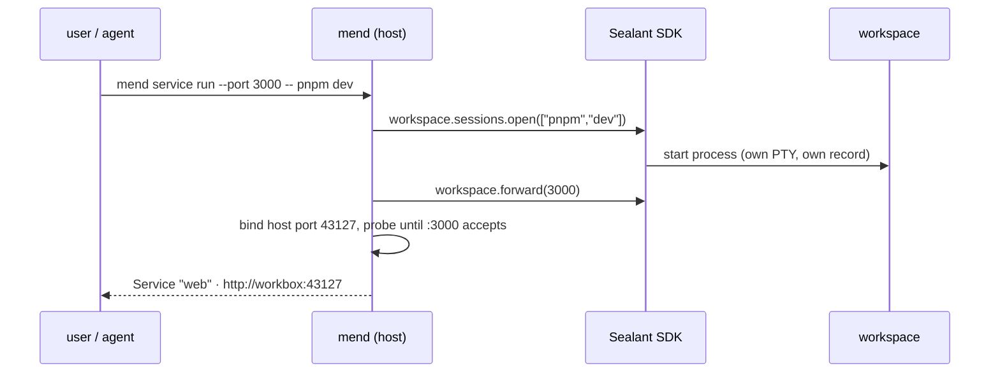

# Session Services

> **Status:** Decided architecture, amended 2026-08-21
>
> **Date:** 2026-08-12
>
> **Canonical direction:** Read with `MEND-AGENT-WORKBENCH-PLAN.md` §7.6, §8.1.H, and the 2026-08-20
> decision log. Services are explicit session capabilities exposed through raw per-port forwards on
> loopback and selected private interfaces.

## What

A **Service** is a long-running process in a Mend session that the user has explicitly told Mend
about. Once declared, Mend does two things with it:

1. **Makes it reachable.** The user opens it from their laptop or phone as if it ran locally.
2. **Makes it visible.** Services appear on every Mend surface — CLI, web, phone — with observed
   state, logs, and Open / Restart / Stop actions.

Anything that listens on a port qualifies: a Vite dev server, a Postgres container, an Express API,
a Go binary. A Service is part of ongoing work — not a deployment, not a claim that the application
is correct.

## Why

Mend owns the session worktree and runs it inside a Sealant workspace. The user cannot open a
terminal at that worktree and run `pnpm dev`; any server they or their agent starts is trapped
inside the workspace network. That breaks the most ordinary loop in development:

```text
normal checkout                       Mend session
──────────────────────────────       ─────────────────────────────────────────
pnpm dev                             mend service run --port 3000 -- pnpm dev
open http://localhost:3000           open http://workbox:43127
```

Services restore that loop. They also answer a question no single terminal can: _what is running
right now across all my sessions?_ — one list, from any device.

## Two rules

**Explicit creation.** A recipe or user action creates a Service. Mend never scans container
internals or guesses which process owns a port. Reading project manifests in `mend service init` may
propose recipes for confirmation. A future typed listener event from the public Sealant SDK may also
produce a factual suggestion such as `Port 5173 started listening, observed`; accepting the
suggestion is still explicit. No observation creates or exposes a Service by itself.

**Private forwarding, no Mend request authentication.** A Service binds only to loopback and
explicitly selected private interfaces by default, with Tailscale or a similar network for remote
reachability. Mend adds no login or ticket in front of the raw port. The UI says that anyone who can
reach the private address can connect. Wildcard and public bindings are refused unless a later
operator policy explicitly allows them.

## The model

**A worktree is a durable named place; a session is one conversation inside it plus its record;
everything that interacts is a process** (decided 2026-08-21, amended 2026-08-31 — the worktree
became the container: many sessions per worktree, several live at once). A session has one current
workspace. Every process in it — the coding agent included — is a `session_processes` row with the
same lifecycle, one of four kinds:

| kind             | what runs                               | transport today         |
| ---------------- | --------------------------------------- | ----------------------- |
| `shell`          | the image's login shell in the worktree | PTY → `/api/tty`        |
| `agent-pty`      | `codex` / `claude` / `opencode` TUI     | PTY → `/api/tty`        |
| `agent-protocol` | `codex app-server` / claude stream-json | pipe → conversation API |
| `service`        | a recipe command (dev server, db…)      | logs + port             |

A session holds several agent processes over its life — relaunch, follow-up, resume, and protocol
turns from another device. The change is **one per worktree** (worktree vs base); every conversation
in the worktree contributes to the same change, and the checkpoint chain is the worktree's — one
dense ordinal sequence across its sessions. Harness native state (the transcript, the provider
session id a native resume addresses) is harvested **per agent process**; "the session's provider
id" means the latest agent's.

**Mode handoff** (`POST /sessions/:id/handoff`, claude and codex): the same conversation moves
between `agent-pty` and `agent-protocol` — one live agent process at a time, the provider session id
the durable identity. A protocol pickup backfills PTY-era turns from the native transcript into the
durable conversation (the live adapter's own item mapping — real ids, raw blocks); a terminal pickup
resumes natively with the phone-authored turns in scrollback. `mend rejoin`/`mend resume` route
formerly-protocol sessions through it automatically.

**Session status is a fold over live processes, never a property of one process:**

```text
any agent process live                       → running
no agent live, shells or Services live       → idle
nothing live                                 → settled: completed | failed | stopped
                                                (the last agent process's outcome)
```

`waiting` stays defined but only a protocol-mode agent can report it. `starting` is a launch without
a process row yet. Stop ends the agent processes; shells and Services keep their own lifecycle, so a
stopped agent beside a live shell reads `idle` until the shell ends. Clients that need the agent's
outcome while a shell holds the workspace read the session's `currentAgent`
(`SessionDetail.currentAgent`, the list annotation) rather than the fold.

The coding agent, supporting shells, and Services share the same worktree, dependencies, and
network. Their states remain independent: the coding-agent run can complete while a shell or Service
retains the workspace.

```text
Mend session, durable
├── coding-agent conversation and ordered runs
├── worktree and change
├── Service · web, stable identity
│   ├── attempt 1 · pnpm dev · Sealant run
│   ├── attempt 2 · pnpm dev · Sealant run
│   └── current forward · host port -> workspace port
├── Service · db, adopted port with no process attempt
└── current workspace, replaceable
    ├── agent processes (agent-pty or agent-protocol)
    ├── supporting shell processes
    └── current Service attempts
```

The stable Service, its process attempts, its host forward, and target observations are separate
facts. Restart appends an attempt and preserves prior run pointers, output, exits, and timestamps.

There are two ways to declare a Service:

| path                                       | what Mend does                                                        | typical case                             |
| ------------------------------------------ | --------------------------------------------------------------------- | ---------------------------------------- |
| `mend service run --port 3000 -- pnpm dev` | starts and supervises the command in the workspace, forwards the port | dev server, API server the user launches |
| `mend service add 5432 --name db`          | forwards an already-listening workspace port; no supervision, no logs | docker compose database, sidecar process |

That is the creation surface. Listener observations may later suggest one of these explicit actions,
but never perform it automatically.

### Declared Services — `mend.toml`

A repository can declare its Services once, in a `mend.toml` at the repo root — versioned with the
code, so it travels to every collaborator and every session worktree:

```toml
[service.web]
command = "pnpm dev"
port = 3000
browserScheme = "http"

[service.db]
# No command: an already-listening port to adopt (compose sidecar, external daemon).
port = 5432
```

A declaration is a recipe, never a running process. `mend service run web` starts one by name; the
web, desktop, and phone Run Service forms offer the declared set. Mend reads the file beside the
worktree when the deployment co-locates it, and from the session's live workspace
(`/workspace/repo/mend.toml`, through the SDK's exec) when it does not — the capture store's MicroVM
executors. With no live workspace in that mode the file is not observable: the recipe list answers
the project's recipes only, and running a file recipe is refused with a message that says so. A
port-only entry is an `add` recipe. Nothing autostarts: declaring, claiming a hot workspace,
resuming, and reconnecting do not start a Service. The session's worktree copy is authoritative, so
an agent can add a recipe as part of its change and Review shows that edit.

Transport and browser behavior are separate. `protocol` remains `tcp | udp`; `browserScheme` is
optional `http | https`. Mend shows Open only when a browser scheme exists. Other Services show Copy
endpoint.

`mend service init` scaffolds the file: it reads the project's own manifests — package.json scripts,
compose files — and proposes entries for the user to confirm and commit. A generator for the recipe
file, nothing more.

## How it works

### Forwarding: one host port per Service, raw TCP

Mend allocates a host port per Service, binds it to loopback and the selected private interfaces,
and pumps bytes to the workspace port over the Sealant SDK forwarding primitive (§8.1.H). No HTTP
proxy, no path rewriting, no header inspection.

```text
laptop / phone                     Mend (host)                        session workspace
──────────────                     ───────────                        ─────────────────
browser ────────▶ workbox:43127 ── byte pump ── workspace.forward(3000) ──▶ :3000 vite
psql ───────────▶ workbox:43128 ── byte pump ── workspace.forward(5432) ──▶ :5432 postgres
```

Raw TCP is a consequence of the requirements, not a preference:

- **Protocol-agnostic.** Postgres, gRPC, and websockets are not HTTP; a byte pump carries them all.
- **Nothing to break.** HMR, SSE, redirects, uploads, and absolute asset paths work because nothing
  inspects the stream.
- **Distinct origin for free.** One port per Service gives each web app its own browser origin, so
  repository code never runs on Mend's authenticated origin.

Two sessions can both use internal port 3000; their workspace networks are isolated and each Service
gets its own host port. The user never resolves collisions.

A friendly lookup (`session:port` → host port) can layer on later in the web UI or via local DNS; it
is presentation, not transport.

### Starting a supervised Service



`mend service run` returns as soon as the port accepts connections (or fails with the process's
output). The Service then lives independently: its own logs, its own lifecycle. It never occupies an
agent tool call.

**The agent uses the same path.** The workspace contains a scoped `mend` helper, and the harness
prompt includes one instruction:

> Use `mend service run --port <port> [--http|--https] -- <command>` for any long-running server. Do
> not background it inside a tool call.

`--http`/`--https` (on `run` and `add`) declares the browser scheme, refused with `--udp`; without
one the Service gets no Open link and no attach tunnel. The note is written into every workspace,
co-located or captured. The helper's credential permits only session-local actions (start a sibling
process, declare a port); it is not an administrator token.

### Which session?

`mend service` runs from an ordinary host terminal. Inside a workspace the injected helper is
already scoped to its own session; on the host, the CLI resolves the target in this order and never
guesses silently:

1. An explicit argument: `mend service run <session> --port 3000 -- pnpm dev`.
2. The only live session for the adopted project matching the current directory.
3. A compact interactive picker when more than one candidate remains.
4. Otherwise fail and explain — non-interactive callers never get the newest session by default.

Both interactive layers make the explicit argument cheap:

- **Dynamic shell completion.** Shipped zsh/bash/fish completions resolve `<session>` and
  `<service>` arguments live by asking the local Mend daemon (a hidden `mend __complete` command),
  so `mend service run <TAB>` offers live sessions and `mend service logs <TAB>` offers running
  Services.
- **The picker.** A small list TUI (the CLI's existing opentui stack): session name, project, agent
  state, age; type-to-filter, enter to select. The same picker backs every command that needs a
  session or Service and received none.

### Observed states

Do not collapse process, forward, and target state into one word:

```text
process     starting | running | exited | stopped | absent
forward     binding | bound | failed | closed
target      reachable | unreachable | unobserved
workspace   ready | retained | unreachable | stopped | expired
```

`reachable` means the target accepted the declared transport. It does not mean healthy, ready,
authenticated, or correct. Each observation carries its time and error when one exists. An adopted
Service has no Mend-owned process attempt, so its process state is `absent` and it has no Restart,
Stop process, or process logs action.

## Lifecycle

**Workspace leases.** The workspace stays up while any coding agent, supporting shell, Service, or
explicit temporary operation holds a live lease. A completed coding-agent run does not release other
leases. Mend renews ordinary workspace expiry while a lease remains live; if renewal fails, the UI
shows the last successful renewal and known expiry.

Leases persist and reconcile after a Mend restart. Mend reattaches to surviving processes rather
than inventing replacements — `agent-protocol` processes included since restart policy v2: the
adapter rehydrates against the surviving pipe by replaying the recorded output, and only an
unreachable pipe or a failed rehydrate ends the row (with a relaunch by provider id, not a failed
session). When the last lease ends, Mend stops the workspace promptly.

**Disconnection is not intent.** A closed browser, desktop app, dropped network, or detached CLI
stops nothing. Stops are explicit. The one exception is declared intent: with the background
sessions switch off (or `--foreground`), the launching CLI enforces foreground semantics — it stops
the session when it exits, best-effort on signals.

**Resume.** When supporting processes retain the workspace, resuming the coding agent starts a new
run in that workspace and leaves them intact. The user may instead choose Stop retained work and
resume fresh, with every process named before confirmation. Once no retained workspace exists, a
later resume provisions a fresh workspace around the same worktree. Services never autostart there.

## Data

Persist four related records rather than overloading one process row:

```text
Service
  id · sessionId · name · declarationSource
  workspacePort · transport · browserScheme · bindPolicy
  preferredHostPort · currentAttemptId · currentForwardId

ServiceAttempt
  id · serviceId · workspaceId · argv
  sealantSessionId · sealantRunId · processState
  lastObservedSequence · exitCode · startedAt · exitedAt

ServiceForward
  id · serviceId · workspaceId
  preferredHostPort · currentHostPort · boundAddresses
  forwardState · forwardError · previousEndpoint · openedAt · closedAt

TargetObservation
  serviceId · targetState · lastObservedAt · lastObservationError
```

Project-local recipes remain the machine-specific companion to repository `mend.toml` recipes. Every
client shows the recipe source. Name collisions are visible and the shadowed recipe cannot run.

## Surfaces

```text
mend service run [session] --port <port> [--name <n>] -- <command>
mend service run [session] <name>        start a declared Service (mend.toml recipe)
mend service add [session] <port> [--name <n>]
mend service init                        scaffold mend.toml from the project's manifests
mend service list [session]
mend service connect [name…] [--port <p>]   tunnel live Services to this machine's loopback
mend service logs <service>       (supervised: attach to its PTY/record)
mend service restart <service>
mend service stop <service>
```

Every surface presents the same facts:

```text
web
process running
forward bound · 127.0.0.1:43127
TCP accepted on :3000 · observed 12s ago

http://127.0.0.1:43127

[ Open ] [ Logs ] [ Restart ] [ Stop ]
```

An adopted database port instead shows `Port only, no Mend process or logs` with Copy endpoint and
Remove forward. The phone and desktop are control surfaces for the same runtime, not separate
execution environments.

**Reaching a Service from another machine.** A loopback endpoint answers on the Mend host only. On
an instance declared `public` every Service forward stays on loopback, so a browser elsewhere cannot
open it. The web and desktop then show no Open link; they show `mend service connect <name>`
(copyable) and say that the CLI tunnels it to that machine's loopback. A private-interface endpoint
keeps Open, since a client on that network reaches it.

The CLI tunnel is one authenticated WebSocket per connection (`service-tunnel`, an upgrade ticket
each). `mend service connect` opens it on request. `mend attach`, `mend codex|claude|opencode`,
`mend rejoin`, and the dashboard open it without being asked, when the server is not the machine the
CLI runs on:

```text
laptop (mend attach)                 Mend (alpha)                 MicroVM executor
────────────────────                 ────────────                 ────────────────
browser → localhost:5173 ── tunnel ── service-tunnel socket ── workspace.forward(5173) ──▶ :5173
```

- Which Services: the attached session's live TCP Services that declare `http` or `https`. The
  dashboard's are those of the selected session, after a short dwell.
- Which port: the Service's own port when it is free on this machine, else a free one. One line
  each, `web → http://localhost:5173`. Mid-attach lines are drawn on the bottom row, and the cursor
  is put back.
- When: from `/api/events` (the session's `session-process` events), plus a re-read every 20 s. A
  Service that stops closes its tunnel. Detaching closes all of them. The Services are never stopped
  from here.
- `--no-tunnel` opts out.

`mend shell` — an interactive shell in the session's current workspace, the terminal that is not ssh
— shares all of this plumbing (concurrent processes, plural records, leases, session resolution) and
slots into the delivery order below. Its own design details (shell selection, multiplexer
integrations) stay a separate document; nothing in Services depends on them.

## Platform requirements (Sealant)

Mend consumes the platform only through the public SDK. Needed, tracked in `PLATFORM-FEEDBACK.md`:

- **Workspace port forwarding** — a duplex byte stream to a workspace port, e.g.
  `workspace.forward(port)` (§8.1.H).
- **Concurrent processes per workspace** — verified support for multiple
  `workspace.sessions.open(argv)` processes with independent lifecycle, detach/reattach, signals,
  and exit reporting.

Nothing here requires listener observation, process-tree attribution, or Docker/runtime internals.
Typed public listener events are an optional future input for declaration suggestions only.

**Spike results (2026-08-12, SDK 0.9.0 and 0.13.1 against the deployed platform):** the shared
workspace holds. Two concurrent PTYs in one mount-sourced workspace, independent output streams,
shared filesystem, shared network (a listener opened in one PTY answers a client in the other),
independent close with the sibling unaffected, `sessions.get()` reattach, and resize all verified.
Two platform defects recorded in `PLATFORM-FEEDBACK.md`: `session.signal()` rejects with a daemon
error (raw `^C` through PTY input works as the interim path), and 0.13.1 drops the exit code on a
clean exit.

## Delivery slices

Every platform capability flows sealantd → public SDK → Mend server → CLI → web/phone; each slice
runs that full stack and ships something usable on its own.

1. **Spike: prove concurrency.** No product code. Two PTYs in one workspace via the SDK, independent
   detach/reattach, working directory, resize, signals, exit reporting. The go/no-go for everything
   below.
2. **Lifecycle foundation.** Session-owned shells, plural attempts, terminal-addressed attachment,
   workspace leases, TTL renewal, and reconciliation after a Mend restart.
3. **Stable Service history.** Separate Service, attempt, forward, and target observation records;
   append attempts on restart and preserve every Sealant run pointer.
4. **Private forward policy.** Public SDK forwarding, explicit interface selection, server-resolved
   endpoints, browser-scheme declarations, endpoint movement, and read-only record logs.
5. **Dogfood in CLI and web.** Correct post-completion controls, recipe collision visibility, event
   invalidation, TCP, UDP, HMR, restart, and retained-workspace resume.
6. **Desktop and phone.** Session-nested Services, factual state, explicit actions, stale
   observation timestamps, and no standalone inbox rows for ordinary reachable Services.

## Acceptance scenarios

1. The user runs `mend service run --port 3000 -- pnpm dev` and opens the app on their laptop
   without editing any configuration.
2. The agent, asked to run the app, uses the same command; the user opens the reported URL.
3. The agent edits a component; the browser receives HMR through the Service URL.
4. `mend service add 5432` makes a workspace Postgres reachable from host `psql`.
5. Two sessions both use internal port 3000 and get independent URLs.
6. The agent settles while a Service runs; the workspace survives and states are reported separately
   (`Agent · completed`, `web · reachable`).
7. A closed browser or detached CLI stops nothing; Mend restarts and reconciles the live Service.
8. The same Service opens from a phone on the tailnet with no login step.
9. On a `public` instance with MicroVM executors, `mend attach` on a laptop tunnels the agent's
   `--http` Service to `localhost:<port>`; the web shows `mend service connect <name>` rather than
   an Open link to the host's loopback.

## Open decisions

- Host port allocation range. A stable Service prefers its previous port and reports endpoint
  movement when that port is occupied.
- The friendly-address lookup (`session:port`), if ever; this is presentation only.
- The full `mend.toml` recipe shape beyond command, port, transport, and browser scheme. Add cwd,
  environment references, or readiness rules only when a real project needs them.
