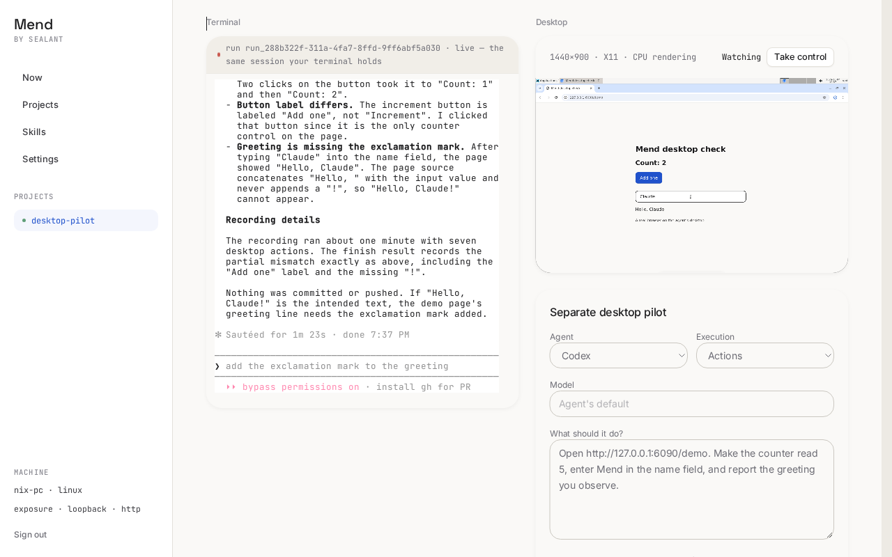
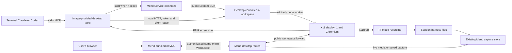

# Computer use in Mend: prototype and implementation handoff

Documented 2026-10-08. Exercised 2026-10-07 on Linux amd64. The owner accepted the proof of concept
as successful and asked to retain it for a later release. No shipping version has been chosen.

The result is a real Mend coding session whose Claude or Codex terminal agent can operate Chromium
on the same desktop the human sees. The human can take control. The session retains a video,
screenshot, action log, and observed result. An optional separate desktop pilot also works.

This is an experiment branch, not a production implementation contract. Use the findings and
acceptance cases below when implementing the feature. See the [local runbook](computer-use-local.md)
for reproduction. The prototype branch also contains `deploy/desktop/README.md` with image commands.

## Proven outcome and evidence

| Case                                            | Observed result                                                                                                                      | Desktop calls | Recording                                           |
| ----------------------------------------------- | ------------------------------------------------------------------------------------------------------------------------------------ | ------------- | --------------------------------------------------- |
| Codex terminal agent, same coding conversation  | Created and served its own counter page, then reached `Count: 5`, input `Mend`, and `Hello, Mend!` through Chromium                  | 3             | [MP4](assets/codex-terminal.mp4), 24.08 seconds     |
| Claude terminal agent, same coding conversation | Reached `Count: 2` and `Hello, Claude` on the bundled demo; correctly reported the missing `!` and the actual button label `Add one` | 7             | [MP4](assets/claude-terminal.mp4), 56.83 seconds    |
| Separate Codex pilot, code batches              | Verified the coding agent's page at `Count: 5` and `Hello, Mend!`                                                                    | 4             | Retained in the local session capture               |
| Separate Claude pilot, screenshot actions       | Verified that page at `Count: 3` and `Hello, Claude!`                                                                                | 8             | Retained in the local session capture               |
| Human takeover of a separate pilot              | Stopped the pilot, accepted manual VNC input, and released control; parent coding process stayed alive                               | Diagnostic    | Retained locally                                    |
| Human takeover of terminal desktop execution    | Aborted an active code worker with HTTP 400, `The operation was aborted`; coding process stayed alive                                | Diagnostic    | [State and methodology](computer-use-evidence.json) |
| Replay after a workspace stopped                | Saved MP4 matched the live file byte for byte; `bytes=1024-4095` returned the expected 3072 bytes; browser video loaded              | Diagnostic    | Earlier stopped fixture session                     |

Desktop call counts exclude beginning and finishing recording, coding tools, and model turns. They
are observations from these small cases, not reliability or performance benchmarks. Terminal
recordings currently have `mode: "code"` even when Claude chooses screenshot actions;
`source: "terminal"` is the useful distinction. The optional pilot limits its tools to the selected
mode.

The takeover abort test used a controlled HTTP client inside the workspace, not another provider
conversation. An earlier probe used one `desktop.wait(25000)`, which clamps to five seconds and
finished before takeover. The final probe used six five-second waits and observed actual abortion.

[Machine-readable evidence](computer-use-evidence.json) retains session/recording IDs, exact result
text, timestamps, image revisions, video hashes, and the takeover methodology. The checked-in videos
show only the synthetic demo pages. The screenshot below shows the real terminal beside the live
desktop. These small artifacts are kept with this handoff because the local capture store and
loopback URLs may disappear.

## What computer use means here

The agent receives a screenshot, reasons about the task, calls a tool, and inspects the resulting
screenshot. The prototype offers two ways to express the action:

- Screenshot actions: `click`, `type`, `key`, `scroll`, and `open_browser`, with an image after each
  action. `screenshot` observes without input.
- Code batches: `execute` runs short JavaScript using the desktop helpers, then returns an image. A
  batch can perform several actions between model calls.

Both are model-driven observation/action loops. Code mode does not translate the entire user request
into one deterministic program. This prototype has no DOM/accessibility-tree browser adapter and
uses neither a provider-native computer-use API nor a dedicated computer-use model. It uses ordinary
Claude Code/Codex conversations receiving images through MCP.

## Processes and boundaries

The CLI process, MCP server, controller, Chromium, X server, and FFmpeg run inside the session's
Sealant workspace container. Model inference goes to the connected provider. Mend's API/web tier and
the user's browser run outside that container. A GPU is not required.

The VNC connection actually terminates at the X server's port 5901. HTTP controller/media traffic
uses port 6090. Websockify on 6080 serves the standalone fixture; the real Mend viewer forwards
binary VNC directly through the SDK. Container-local `127.0.0.1:3000` refers to an application in
that workspace, not the user's host.

A session, its Sealant run, and a desktop recording have different IDs. The controller's `run.id` is
a recording UUID, not a Sealant run ID and not another Mend session. The native coding record
contains the terminal agent's MCP calls. The separate pilot has its own CLI conversation.

## Image and native agent setup

The current experimental preset is `mend-desktop:pilot-v4`, built from `node:26-bookworm-slim` for
amd64. It installs XFCE, TigerVNC, X11 utilities, xdotool, software Mesa graphics, Chromium,
ImageMagick, FFmpeg, noVNC/websockify, fonts, and normal build/helper tools including `curl`.

The image bundles pinned CLIs for the standalone fixture. Sealant's custom-base build subsequently
installs its daemon and selected harness, so the runtime harness version also follows Core's recipe.
The Dockerfile's CLI pins alone are not the authority for a real workspace. The image uses
`USER root` because Core's builder installs as root; the standalone fixture explicitly runs as
UID/GID 1000. The real acceptance sessions used the shared/root layout. Person-layout paths and
credential owners are implemented, but that layout has not been dogfooded for this feature.

Mend's Claude/Codex bootstrap checks for the image's wrappers and prepends `/opt/mend-desktop/bin`
to PATH. The wrappers invoke `launch.mjs`, which adds MCP registration and runs the actual CLI at
`/usr/local/bin/<harness>` with inherited stdio. It forwards process signals.

- Codex receives command/args overrides for `mcp_servers.desktop` and the session channel
  environment names needed by its MCP child. Tokens are not placed in argv.
- Claude receives the image's `agent-mcp.json` through `--mcp-config` and allows `mcp__desktop__*`.
  The terminal keeps its normal coding tools. The separate pilot intentionally has a narrower CLI
  tool configuration.
- Mend's bounded workspace note adds a pointer to `/opt/mend-desktop/SKILL.md` when the image
  provides the wrapper. The note lives in the harness's global instructions and preserves content
  outside Mend's managed block. The skill teaches starting a server, observing the screen, recording
  a task, finishing with observed results, and pausing for takeover.

A skill describes tool use; MCP registration makes the tools available. Both are necessary.
Already-running CLIs need a relaunch to load the new registration. Ordinary workspace images keep
their native PATH and receive no desktop instruction pointer.

## Terminal workflow and controller ownership

The terminal MCP client exposes both action styles plus `begin_recording(goal)` and
`finish_recording(result)`. Its stdio requests execute sequentially. A normal verification is:

1. The coding agent builds its change and starts the app with `mend service run`, listening on IPv4.
2. It calls `begin_recording`. The MCP child checks controller state and invokes the existing
   `mend service run --port 6090 --name desktop --http -- ... /opt/mend-desktop/start` when needed.
   It refuses a controller belonging to a different session. A first screenshot/action also starts a
   recording if the agent omitted the explicit beginning.
3. The controller creates the recording directory, starts FFmpeg, and grants input to that MCP
   client's random lease. Another client or separate pilot cannot claim the active recording.
4. The agent inspects screenshots and uses actions or short code batches against the same display
   the human watches.
5. `finish_recording` captures a final PNG, stops FFmpeg, saves state/result/transcript, and
   releases input. The artifacts appear on the session page.

A controller-local token is written to `/tmp/mend-desktop-<uid>.token` with mode 0600, outside the
captured harness roots. Terminal clients read it as the same workspace user. The token and lease are
authorization for this local protocol, not a sandbox against a coding agent that already has shell
access. The lease is not saved in the recording state. Controller restarts rotate the token.

Taking control sets human ownership, aborts active desktop code, and ends the recording as
`cancelled`. For a terminal client, it leaves the native coding process alive. For a separate pilot,
it terminates the pilot's process group as well. The user must release control before agent desktop
work resumes. The skill tells the terminal agent to await the user's instruction; this is an
instruction, not a provider-enforced pause of all coding work.

Terminal recording ends as `interrupted` on an orderly MCP disconnect. SIGKILL/OOM recovery is not
proven. A controller restart reports saved `running` recordings as interrupted because it cannot
resume their old inference or code execution.

Current limits are a five-minute recording/pilot deadline, a 30-second code worker deadline, a
35-second MCP HTTP timeout, and a maximum five-second wait per `desktop.wait` call. The live history
shows up to 20 recordings. These are prototype constants, not a final budget policy.

## Optional separate pilot and credentials

The session UI can launch a separate Claude/Codex pilot with a goal, model, and action/code mode.
This process runs inside the same container and does not drive the parent's coding conversation.

Before launch, the Mend API puts the chosen owner's connected login into
`/home/mend-desktop-<session>` using the public SDK credentials operation. Shared layout currently
uses owner UID/GID 1000; person layout uses the person's UID and Mend group. The desktop Service
sets `CODEX_HOME` and `CLAUDE_CONFIG_DIR` to this separate source home.

Each pilot copies only its selected login into a private temporary native home. That home is removed
on completion. This avoids harvesting its native conversation as the parent's transcript. The
controller retains its own text observations, action log, and media. The copied login is not written
back into Core. The terminal path uses its original coding login and conversation and needs no
second login copy.

## Viewing, recording, and replay

The session page places the terminal on the left and desktop on the right at desktop widths; smaller
screens stack them. The terminal stays visible while scrolling the desktop column. Controls and
recording cards sit below the desktop. The optional separate pilot is labelled as such.

Mend bundles the noVNC JavaScript. Only pixels/VNC bytes arrive from the workspace. The
authenticated HTTP adapter admits controller operations and four artifact filenames. It rejects
workspace `/viewer`, `/novnc/*`, arbitrary files, `/action`, and `/session/*`, and chooses media
types itself. The workspace cannot select HTML or executable JavaScript content types through this
bridge. Browser cookies and bearer credentials are not forwarded into the workspace HTTP request.

Desktop API access first applies session/project visibility and then requires the session owner.
Shared control does not grant desktop access. The socket reuses revocation registration, incoming
frame limits, connection budgets, and the application's origin policy. The viewer's view-only
setting is a client convention; an authorized owner can still send VNC input directly.

FFmpeg captures display `:1` at 1440×900, 12fps, H.264/yuv420p with MP4 faststart. Each directory
contains `state.json`, `recording.mp4`, `final.png`, `actions.jsonl`, and `transcript.txt`, with
additional diagnostics. Native image payloads may also appear in the coding agent's own record.

| Layout | Captured recording directory                                                |
| ------ | --------------------------------------------------------------------------- |
| Shared | `/workspace/harness-home/.mend/desktop/<session>/runs/<recording>`          |
| Person | `/workspace/harness-home/people/<owner>/desktop/<session>/runs/<recording>` |

Artifact links keep the same session API URL. When forwarding fails or the workspace has ended, GET
requests can read the latest saved worktree capture. The state names the observed capture and sets
`live: false`; controls are disabled. Captured byte ranges support `bytes=start-end` and
`bytes=start-`; suffix/multiple ranges are refused. A saved snapshot of a running recording is
reported as interrupted, not resumed.

The capture reader scans at most 1000 entries and takes at most 20 state files before sorting. It
needs indexing/pagination before larger histories. It may lack an artifact completed after the last
capture. A truncated MP4 may be unplayable after an abrupt recorder death. Live recording should not
be treated as durable until the capture containing its completed files is saved.

The ordinary raw Service listener remains separate from this authenticated bridge and currently
reports `Mend auth: none`. Its controller endpoints are not protected by Mend's web sign-in. Closing
or separating that listener is a release requirement, even though the authenticated viewer itself
admits only the paths listed above.

## Implementation map

These source paths refer to the local `feat/desktop-pilot` prototype branch. This documentation PR
retains the findings and evidence only; the implementation is not included in main.

| Responsibility                               | Owning files                                                                                                                                                                                |
| -------------------------------------------- | ------------------------------------------------------------------------------------------------------------------------------------------------------------------------------------------- |
| Image, display and child-process lifetime    | `deploy/desktop/Dockerfile`, `deploy/desktop/start`                                                                                                                                         |
| Native CLI registration                      | `deploy/desktop/launch.mjs`, `deploy/desktop/agent-mcp.json`, `packages/sessions/src/harness-seeds.ts`                                                                                      |
| Model instructions                           | `deploy/desktop/SKILL.md`, `packages/sessions/src/workspace-note.ts`                                                                                                                        |
| Stdio tools and lazy Service start           | `deploy/desktop/mcp.mjs`                                                                                                                                                                    |
| Input ownership, recording, pilots, shutdown | `deploy/desktop/server.mjs`                                                                                                                                                                 |
| Parsed actions and screenshot capture        | `deploy/desktop/control.mjs`, `deploy/desktop/code-worker.mjs`                                                                                                                              |
| Pilot conversation isolation                 | `deploy/desktop/pilot-home.mjs`                                                                                                                                                             |
| Authenticated HTTP/VNC and credentials       | `apps/api/src/routes/desktop.ts`, `apps/api/src/routes/desktop-http.ts`                                                                                                                     |
| Saved artifacts and byte ranges              | `apps/api/src/routes/desktop-capture.ts`                                                                                                                                                    |
| Shared state and image preset                | `packages/domain/src/desktop.ts`, `packages/domain/src/settings.ts`                                                                                                                         |
| Session integration and trusted viewer       | `apps/web/src/components/session-desktop.tsx`, `apps/web/src/components/desktop-workbench.tsx`, `apps/web/src/components/desktop-viewer.tsx`, `apps/web/src/routes/sessions.$sessionId.tsx` |
| Standalone acceptance fixture                | `scripts/desktop-preview.mjs`                                                                                                                                                               |

The implementation adds no platform-internal imports. Provisioning, recorded processes, credentials,
and byte forwarding use the existing public Sealant SDK integration. The local Docker fixture and
the developer's Core compose installation are test infrastructure, not a Mend runtime Docker
manager.

## Findings to preserve

- Core's custom-base builder needs root and `curl`; a missing `curl` misleadingly reported a missing
  `/bin/sh`. Keep the image compatible with Core's installation recipe.
- An already compiled custom base did not change when its mutable tag was rebuilt. Changing setup
  commands did not invalidate it either. A new image revision/tag fixed it.
- Long host control paths exceeded Linux AF_UNIX pathname limits and broke daemon connectivity. The
  local fixture used `/tmp/mdpctl` for the control directory.
- The host firewall blocked Docker-to-host access to the Mend channel. A private TCP-to-Unix relay
  recovered the local setup. Treat that as a local networking workaround, not a product transport.
- Core refused arbitrary credential homes without proper ownership and refused replacing the active
  legacy root login. A separate `/home/mend-desktop-<session>` with an explicit owner worked.
- Codex pilot conversations must use a disposable native home to keep them out of the coding
  session's transcript harvest. Merely labelling a second CLI process is insufficient.
- The bundled Chromium/demo could be driven by Claude without a special computer-use model. Its
  correct mismatch report is a better acceptance case than requiring it to repeat the requested
  result.
- The browser development build hid differences in production assets during testing. Verification
  used the built web front, same-origin proxy, CSP, and a fresh page load. A later stuck preview tab
  was recovered with a fresh tab and local sign-in.

The prototype branch also records Core/image findings in `PLATFORM-FEEDBACK.md`. Recheck their
status against the public SDK when starting release work; do not preserve an obsolete workaround.

## Recommended production work

These are proposed implementation slices, not approved release scope.

1. **Make image capability explicit.** Publish a versioned amd64 image with reproducible base and
   package inputs. Model desktop support as a workspace capability rather than comparing image
   strings or checking fixed wrapper paths. Register tools through a documented harness
   configuration path that preserves user MCP/profile settings and works for PTY, protocol, resume,
   join, and memory carryover. Remove the fixture/dev route from shipped navigation.
2. **Define desktop ownership and lifetime.** Handle several sessions in one worktree/workspace,
   per-person executors, startup races, stale token files, controller restarts, service stop, and
   account/project revocation. Current display/ports/token filename allow one controller per
   workspace/UID. Keep takeover atomic across pending actions, queued actions and code descendants.
   Determine whether the separate pilot belongs in the first shipped feature.
3. **Close the raw-listener gap.** Start recorded desktop processes without exposing their control
   HTTP port unauthenticated to the user's network. Keep owner authorization on viewer and media,
   and apply declared/observed exposure reporting. If the public Service/SDK contract cannot express
   a recorded private control process, file platform feedback instead of importing internals.
4. **Record evidence as a supported contract.** Give desktop recordings typed metadata, parent
   session/Sealant run/checkpoint links, and record sequence correlation for tool calls, takeovers,
   failures, and final results. Preserve raw observed output separately from summaries. Add a
   paginated artifact index. Define capture-complete behavior, seekable streaming, retention,
   deletion, size budgets, and recoverable media after abrupt termination. Segmented recording with
   a manifest is a candidate to test. Desktop footage can contain login or repository data; access
   and export must follow the session's content policy.
5. **Choose browser state and execution policy.** Decide what happens to browser cookies/downloads
   on resume. The POC promises artifact persistence, not durable browser profiles. The Node code
   worker can access the workspace's files and network; it is not a JavaScript sandbox. Chromium
   currently uses `--no-sandbox`. Resolve this alongside the supported executor isolation and
   credential policy. Test screen-text prompt injection, not just successful clicks.
6. **Finish the product interaction.** Keep terminal and pixels in one viewport, usable on small
   screens, with keyboard/focus handling, connection state, takeover/release, progress, and clearly
   identified recorded observations. Avoid conflating terminal source with execution style. Add
   accessible controls and reconnect handling without accidentally granting input. Link a review
   claim to its recording or runnable check, without a verdict.
7. **Exercise the supported deployment matrix.** Start with Linux amd64. Test Docker and supported
   Kubernetes executors, proxy/TLS origins, captured and co-located stores, slow model responses,
   CPU/memory limits, credentials rotation, account removal, and several sessions. Establish limits
   from measurements before expanding to other architectures or clients.

## Release acceptance criteria

A future implementation is complete only when the supported configurations meet these cases:

- A fresh Claude and Codex session can build a page, start its server, operate the visible browser,
  and report the observed result in its own conversation without a manual MCP setup step.
- The same workflow works through resume and protocol/PTY handoff; unavailable capabilities give a
  concrete explanation instead of hanging or silently starting another agent.
- Human takeover interrupts ongoing and queued desktop work, accepts input, and leaves the coding
  conversation intact. Release requires an explicit transition back to agent ownership.
- A competing session/person cannot see, control, or overwrite another desktop or its recordings.
  Authenticated access, revocation, origin policy and exposure behavior have integration coverage.
- The viewer serves Mend's trusted code; workspace content cannot become executable content on
  Mend's origin. The raw controller is not an unauthenticated external control channel.
- A completed recording and result remain available after workspace stop, restart, and cold restore,
  with seeking and capture provenance. Abrupt termination has defined partial-artifact behavior.
  Histories beyond 20 recordings remain findable.
- A deliberately different UI or failed action yields the actual mismatch in the record and final
  observation. Prompt-injection fixtures do not redirect credentials or unrelated work.
- Dependencies, browser state, recording budgets and cleanup have explicit ownership and tests.
  Resource use is measured under concurrent sessions.

## Branch provenance and verification

Worktree: `Mend-desktop-pilot`, branch `feat/desktop-pilot`, based on main `d56e81b07` / PR #565.
The prototype commits are `218058a5a` for the standalone pilot, `0486202de` for real sessions and
capture replay, `9364866af` for the side-by-side session layout, and `b96af101b` for terminal MCP
registration and the desktop skill. The prototype implementation remains on its local branch; this
handoff is published separately.

The final code used `@sealant/sdk` and Core API/worker `0.39.0-next.696`. Forced monorepo typecheck
and lint each completed 27/27 tasks. Harness bootstrap/workspace-note tests completed 60 cases; Node
control/MCP/pilot-home tests completed four. Earlier integration also ran the four API
allowlist/range tests and six workspace-environment tests. API, web and CLI production builds ran,
and real captured PTY sessions exercised the provider calls and browser. See the runbook for
commands. Per-person, multi-tenant and public-network acceptance remain unproven.
